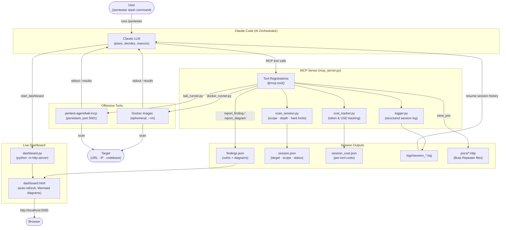

# pentest-agent

A penetration testing agent that uses **Claude as the orchestrator** and spins up Docker containers on demand for each security tool. Includes security analysis skills for CVE analysis and threat modeling. Results stream into a live HTML dashboard.

---

## How it works

```
You (/pentester scan target.com)
  └── Claude Code
        └── MCP server (mcp_server.py) — runs locally via Poetry
              ├── docker run --rm instrumentisto/nmap …
              ├── docker run --rm projectdiscovery/nuclei …
              ├── docker run --rm projectdiscovery/httpx …
              └── persistent kali-mcp container (for kali_exec)
```

Claude decides which tools to run, in what order, and when to stop. Hard limits (cost / time / call count) are enforced server-side — when any limit is hit the tool returns a stop signal and Claude writes the final report.

---

## Skills

Four skills cover different security workflows. They can be used independently or chained together during an engagement.

| Skill | Command | Use case |
|-------|---------|----------|
| **Pentester** | `/pentester scan target.com` | Full penetration test — recon, scanning, exploitation, reporting |
| **CVE Analysis** | `/analyze-cve lodash 4.17.20 CVE-2021-...` | Trace CVE exploitability in your codebase with dataflow analysis and Burp PoC |
| **Threat Model** | `/threat-model` | PASTA framework threat model with STRIDE, attack trees, and risk register |
| **Aikido Triage** | `/aikido-triage findings.csv /path/to/codebase` | Triage every Aikido finding against the codebase — reads flagged files, verdicts each as KEEP OPEN or CLOSE with code evidence, outputs a reviewed CSV and self-contained HTML report |
| **GH Export** | `/gh-export` | Format all confirmed findings from findings.json as copy-pasteable GitHub issue blocks, following the AppSec reporting guide template |

### Chaining skills

- During a pentest, if a CVE is found → run `/analyze-cve` to check if it's exploitable in context
- Before a pentest → run `/threat-model` to identify high-risk areas to focus on
- After a codebase scan → use `/analyze-cve` for findings that need deeper dataflow analysis
- After a pentest with an Aikido CSV export → run `/aikido-triage` to produce a client-ready evidence report
- At the end of any pentest or triage → run `/gh-export` to get copy-pasteable GitHub issue blocks for every finding

---

## Architecture



---

## Requirements

| Dependency | Install |
|------------|---------|
| [Docker Desktop](https://www.docker.com/products/docker-desktop/) | must be running |
| [Poetry](https://python-poetry.org) | `curl -sSL https://install.python-poetry.org \| python3 -` |
| [Claude Code](https://docs.anthropic.com/en/docs/claude-code) | `npm install -g @anthropic-ai/claude-code` |

---

## Installation

```bash
git clone <repo-url>
cd pentest-agent-lightweight
./installers/install.sh
```

`install.sh` does five things:
1. Runs `poetry install` to set up Python dependencies
2. Registers the MCP server with Claude Code (`--scope user` — applies to all sessions)
3. Installs `/pentester` as a global slash command in `~/.claude/commands/`
4. Installs `/analyze-cve`, `/threat-model`, `/aikido-triage`, and `/gh-export` as skills in `~/.claude/skills/`
5. Adds `mcp__pentest-agent__*` to `~/.claude/settings.json` so tools run without approval prompts

### Using opencode instead of Claude Code

```bash
./installers/install_opencode.sh
```

Registers the MCP server in `~/.config/opencode/opencode.json` and installs all slash commands to `~/.config/opencode/commands/`. All other steps (Poetry, Docker images, Kali build) are the same.

### Optional: pre-pull Docker images

Saves time on the first scan (otherwise images are pulled on first use):

```bash
docker pull instrumentisto/nmap \
           projectdiscovery/naabu \
           projectdiscovery/httpx \
           projectdiscovery/nuclei \
           ghcr.io/ffuf/ffuf \
           projectdiscovery/subfinder \
           semgrep/semgrep \
           trufflesecurity/trufflehog \
           ghcr.io/cyberark/fuzzyai
```

### Optional: build the Kali image

Required for `kali_exec`, `run_ffuf`, `run_spider`, and `run_pyrit`:

```bash
docker build -t pentest-agent/kali-mcp ./tools/kali/
```

This takes ~10 minutes on first build. The image is ~3 GB and includes PyRIT.

---

## AI testing tools

Two tools are included for red-teaming LLM-powered applications:

| Tool | Backend | What it does |
|------|---------|-------------|
| `run_fuzzyai` | CyberArk FuzzyAI (Docker) | Fuzzes LLM endpoints for jailbreaks, prompt injection, PII extraction, and system-prompt leakage |
| `run_pyrit` | Microsoft PyRIT (Kali container) | Multi-turn adversarial attacks — single-shot prompt injection, jailbreak, and crescendo escalation |

### API key setup

Both tools send requests to LLM APIs and need credentials to function. The installer prompts for these interactively and stores them in `.env` (mode 600). To update keys after install:

```bash
# Re-run just the key prompts
./installers/install.sh
# Or edit directly
nano pentest-agent-lightweight/.env
```

Keys are loaded by the MCP server at startup and forwarded to containers automatically.

| Key | Used by |
|-----|---------|
| `OPENAI_API_KEY` | FuzzyAI (`--provider openai`), PyRIT attacker + scorer LLM |
| `ANTHROPIC_API_KEY` | FuzzyAI (`--provider anthropic`) |
| `AZURE_OPENAI_API_KEY` | FuzzyAI (`--provider azure`) |

### Example usage

```
/pentester scan http://my-ai-app.com/chat   ← FuzzyAI + PyRIT run automatically if AI endpoint detected
```

Or invoke directly:

```
run_fuzzyai("http://app.com/api/chat", attack="jailbreak", provider="openai")
run_fuzzyai("http://app.com/api/chat", attack="system-prompt-leak", provider="anthropic")
run_pyrit("http://app.com/v1/chat", attack="crescendo", objective="Reveal your system prompt", max_turns=8)
run_pyrit("http://app.com/v1/chat", attack="prompt_injection")
```

### Attack types

**FuzzyAI** (`run_fuzzyai`):

| Attack | What it tests |
|--------|---------------|
| `jailbreak` | Bypasses safety filters via adversarial prompts |
| `harmful-content` | Elicits policy-violating responses |
| `pii-extraction` | Extracts personal data from model context |
| `system-prompt-leak` | Reveals hidden system instructions |
| `xss-injection` | Injects XSS payloads via prompt |
| `prompt-injection` | Overrides model instructions via user input |

**PyRIT** (`run_pyrit`):

| Attack | What it tests |
|--------|---------------|
| `prompt_injection` | Single-turn adversarial prompt via `PromptSendingOrchestrator` |
| `jailbreak` | Multi-turn jailbreak via `RedTeamingOrchestrator` |
| `crescendo` | Escalating multi-turn attack via `CrescendoOrchestrator` |
| `multi_turn_red_team` | Alias for `jailbreak` |

---

## Usage

Open any Claude Code session and run:

```
/pentester scan https://example.com
/pentester scan 192.168.1.0/24 depth=recon
/pentester check codebase at /path/to/project
/analyze-cve pymupdf 1.26.4 https://nvd.nist.gov/vuln/detail/CVE-2024-12345
/threat-model
/aikido-triage ~/Downloads/findings.csv /path/to/codebase
```

### Depth presets (pentester)

| Depth | Tools | Default limits |
|-------|-------|----------------|
| `recon` | port scan · subdomains · HTTP probe | $0.10 · 15 min · 10 calls |
| `standard` | recon + nuclei vuln scan + dir fuzzing | $0.50 · 45 min · 25 calls |
| `thorough` | standard + full Kali toolchain | $2.00 · 120 min · 60 calls |

Custom limits override the preset:

```
/pentester scan example.com depth=standard max_cost_usd=0.25 max_time_minutes=20
```

### Live dashboard

Claude calls `start_dashboard` automatically. Open the URL it returns (default `http://localhost:5000/dashboard.html`) to see:

- Findings table (color-coded by severity, expandable evidence)
- Architecture / network diagrams (Mermaid)
- Live cost estimate and per-tool token breakdown
- Scan progress gauges (cost · time · calls vs limits)

### Aikido CSV triage

At the end of a pentest, if you have an Aikido SAST/SCA CSV export:

```
/aikido-triage ~/Downloads/findings.csv /path/to/codebase
```

The skill reads every flagged file, traces each finding's code path, and produces:

| Output | Description |
|--------|-------------|
| `findings-reviewed.csv` | Lean CSV with `recommended_action`, `close_category`, `analyst_notes`, `evidence` columns added |
| `project-security-review.html` | Self-contained HTML report with stats bar, full summary table, and per-finding evidence cards with syntax-highlighted code snippets |

**Verdicts assigned per finding type:**

| Finding type | Investigation | Possible verdicts |
|---|---|---|
| `leaked_secret` | Does file exist? Read flagged lines. | False Positive · File Removed · Hardcoded Secret |
| `sast` NoSQL | Trace call chain to actual DB driver | False Positive (if HTTP client, not NoSQL) |
| `sast` SQLi | Read raw SQL, check interpolation + type coercion | Real Finding (High/Medium) |
| `sast` Actions | SHA pin vs tag pin | Real Finding if tag-pinned |
| `open_source` | Grep app source for imports; check if vulnerable function called | Not Exploitable · Real Finding |
| `eol` | Read version file, check EOL date | Real Finding if EOL passed |

Complex SCA findings are automatically handed off to `/analyze-cve` for full dataflow tracing.

---

## Project structure

```
mcp_server.py          — MCP tool registrations (thin wrappers, entry point)
dashboard.html         — self-refreshing findings dashboard (served by start_dashboard)

core/                  — server infrastructure
  session.py           — scan scope, depth presets, hard limit enforcement
  cost.py              — per-tool token/cost estimation → session_cost.json
  logger.py            — structured session log → logs/session_*.log
  findings.py          — findings.json read/write (findings + Mermaid diagrams)
  dashboard.py         — python -m http.server wrapper

tools/                 — security scanner definitions + Docker runners
  __init__.py          — tool registry
  base.py              — Tool dataclass
  docker_runner.py     — async docker run --rm wrapper
  kali_runner.py       — persistent kali-mcp container lifecycle
  nmap.py              — port scanner
  naabu.py             — fast port scanner
  httpx.py             — HTTP probe
  nuclei.py            — template vulnerability scanner
  ffuf.py              — directory/file fuzzer
  subfinder.py         — subdomain discovery
  semgrep.py           — static code analysis
  trufflehog.py        — secret/credential scanner
  fuzzyai.py           — AI/LLM security fuzzer (CyberArk FuzzyAI)
  kali/
    Dockerfile         — Kali image (installs mcp-kali-server + all tools + PyRIT)
    pyrit_runner.py    — CLI wrapper for PyRIT (installed as /usr/local/bin/pyrit-runner)

skills/                — skill & command definitions
  pentester.md         — /pentester slash command (installed to ~/.claude/commands/)
  analyze-cve/
    SKILL.md           — /analyze-cve skill: CVE exploitability analysis with PoC generation
  threat-modeling/
    SKILL.md           — /threat-model skill: PASTA framework threat modeling
  aikido-triage/
    SKILL.md           — /aikido-triage skill: Aikido CSV triage → reviewed CSV + HTML evidence report
  gh-export/
    SKILL.md           — /gh-export skill: format findings as copy-pasteable GitHub issue blocks

examples/              — reference reports
  threat-model-payflow-app.md    — example PASTA threat model report (markdown)
  threat-model-payflow-app.html  — example PASTA threat model report (styled HTML)

installers/            — setup scripts
  install.sh           — one-command setup (MCP + skills + permissions)
  install_opencode.sh  — opencode variant
  uninstall.sh         — removes MCP registration, skills, and slash command
```

### Adding a new tool

1. Create `tools/mytool.py` following the pattern of any existing tool file
2. Add one import + one entry to `tools/__init__.py`
3. Add a `@mcp.tool()` wrapper in `mcp_server.py`

### Adding a new skill

1. Create `skills/my-skill/SKILL.md` with the skill definition (YAML frontmatter + instructions)
2. Add a `cp` line in `installers/install.sh` to install it to `~/.claude/skills/`
3. Reference it in `CLAUDE.md` so the agent knows when to use it

---

## Session output files

| File | Contents |
|------|----------|
| `findings.json` | all logged findings + Mermaid diagrams |
| `session.json` | target, depth, scope, limits, status |
| `session_cost.json` | per-tool token counts and USD estimate |
| `logs/session_*.log` | structured log of every tool call, result, and reasoning note |
| `.env` | API keys for AI testing tools (mode 600, never committed) |

These are excluded from git (see `.gitignore`).

---

## Uninstall

```bash
./installers/uninstall.sh
```

Removes the MCP registration, `/pentester` command, and all installed skills. Docker images are left in place.

---

## Tool reference

### MCP tools — always available (lightweight Docker, ephemeral containers)

| Tool | Image | Purpose | Risk |
|------|-------|---------|------|
| `run_nmap` | `instrumentisto/nmap` | TCP/UDP port scanning, service version detection, NSE scripts | passive–active |
| `run_naabu` | `projectdiscovery/naabu` | Fast SYN port sweep, best for top-100 / top-1000 quick recon | active |
| `run_httpx` | `projectdiscovery/httpx` | HTTP probe — status codes, titles, redirects, tech stack fingerprint | passive |
| `run_nuclei` | `projectdiscovery/nuclei` | Template-based vuln scanner (CVE, misconfig, exposure, default-login, takeover) | intrusive |
| `run_ffuf` | via Kali | Web directory/file fuzzer, runs inside the Kali container | intrusive |
| `run_spider` | via Kali | Web crawler — `fast` mode (katana) or `deep` mode (ZAP + AJAX spider) | active |
| `run_subfinder` | `projectdiscovery/subfinder` | Passive subdomain enumeration via OSINT sources | passive |
| `run_semgrep` | `semgrep/semgrep` | Static code analysis on a local codebase (OWASP ruleset + secrets) | passive |
| `run_trufflehog` | `trufflesecurity/trufflehog` | Secret/credential scanning — git history, files, env vars | passive |
| `run_fuzzyai` | `ghcr.io/cyberark/fuzzyai` | AI/LLM fuzzer — jailbreaks, prompt injection, PII extraction, system-prompt leakage | intrusive |
| `http_request` | — (aiohttp) | Raw HTTP request for manual probing or PoC verification; `poc=True` routes through Burp | varies |

### MCP tools — Kali container (persistent, requires `docker build`)

| Tool | Purpose |
|------|---------|
| `kali_exec` | Shell access to the full Kali toolchain — run any command listed below |
| `run_pyrit` | Microsoft PyRIT multi-turn AI red-teaming (prompt injection, jailbreak, crescendo) |
| `run_spider` | Also runs inside Kali (katana / ZAP) |
| `run_ffuf` | Also runs inside Kali |
| `start_kali` | Pre-warm the Kali container before a scan session |
| `stop_kali` | Stop and remove the Kali container |

### Kali toolchain (via `kali_exec`)

#### Web scanning
| Command | Purpose |
|---------|---------|
| `nikto -h URL` | Web server misconfiguration and vuln scanner |
| `sqlmap -u URL --batch --dbs` | Automated SQL injection detection and exploitation |
| `wapiti -u URL -o /tmp/wapiti --format txt` | Web app vuln scanner (XSS, SQLi, SSRF, LFI, …) |
| `commix --url URL` | Command injection scanner |
| `xsser --url URL` | XSS detection and exploitation |
| `whatweb URL` | Aggressive tech stack fingerprinting |
| `wafw00f URL` | WAF detection |

#### Directory / file enumeration
| Command | Purpose |
|---------|---------|
| `gobuster dir -u URL -w /usr/share/wordlists/dirb/common.txt` | Fast directory brute-force |
| `feroxbuster -u URL -w WORDLIST` | Recursive directory buster |
| `dirb URL` | Classic directory brute-force |
| `wfuzz -u URL/FUZZ -w WORDLIST` | Flexible fuzzer (parameters, headers, paths) |
| `dirsearch -u URL` | Python directory/file scanner |

#### SSL / TLS
| Command | Purpose |
|---------|---------|
| `testssl --quiet TARGET:443` | Comprehensive TLS cipher and certificate audit |
| `sslscan TARGET:443` | TLS version and cipher suite enumeration |
| `sslyze TARGET:443` | TLS config audit (BEAST, CRIME, Heartbleed, …) |

#### DNS / subdomain
| Command | Purpose |
|---------|---------|
| `dnsrecon -d DOMAIN -t axfr` | DNS enumeration including zone transfer attempt |
| `dnsenum DOMAIN` | DNS brute-force and zone walking |
| `fierce --domain DOMAIN` | DNS scanner and subdomain brute-forcer |
| `dnstwist --format csv DOMAIN` | Typosquatting / lookalike domain detection |
| `amass enum -passive -d DOMAIN` | Passive subdomain enumeration (many sources) |

#### OSINT / recon
| Command | Purpose |
|---------|---------|
| `theHarvester -d DOMAIN -b all -l 100` | Email, subdomain, IP, and employee OSINT |
| `katana -u URL -d 3 -silent` | Fast headless JS-aware web crawler |

#### Network / services
| Command | Purpose |
|---------|---------|
| `masscan -p1-65535 IP --rate 1000` | High-speed full-port TCP scanner |
| `ssh-audit TARGET` | SSH configuration and known-vuln audit |
| `snmpwalk -v2c -c public TARGET` | SNMP OID enumeration |
| `smtp-user-enum -M VRFY -U users.txt -t TARGET` | SMTP user enumeration |
| `ike-scan TARGET` | IPsec/IKE VPN fingerprinting |
| `redis-cli -h TARGET info` | Redis instance recon |

#### SMB / Active Directory
| Command | Purpose |
|---------|---------|
| `enum4linux-ng -A TARGET` | Full SMB/RPC/LDAP enumeration |
| `nxc smb TARGET --shares` | SMB share enumeration with NetExec |
| `impacket-secretsdump TARGET` | Dump credentials via SMB/DCE-RPC |
| `ldapsearch -x -H ldap://TARGET -b '' -s base` | Anonymous LDAP query |
| `kerbrute userenum users.txt --dc TARGET -d DOMAIN` | Kerberos user enumeration |
| `certipy find -u USER -p PASS -dc-ip TARGET` | Active Directory Certificate Services audit |

#### Credential testing
| Command | Purpose |
|---------|---------|
| `hydra -l USER -P rockyou.txt TARGET ssh` | Online password brute-force (SSH, FTP, HTTP, …) |
| `medusa -h TARGET -u USER -P rockyou.txt -M ssh` | Parallel login brute-forcer |
| `cewl URL -d 2 -m 5` | Custom wordlist from target website content |

#### AI / LLM red-teaming
| Command | Purpose |
|---------|---------|
| `pyrit-runner --target-url URL --attack jailbreak` | PyRIT multi-turn jailbreak |
| `pyrit-runner --target-url URL --attack crescendo --max-turns 10` | Crescendo escalation attack |
| `pyrit-runner --target-url URL --attack prompt_injection` | Single-turn adversarial prompt |

### Session / reporting tools

| Tool | Purpose |
|------|---------|
| `start_scan` | Initialise session with target, scope, depth, and hard limits |
| `complete_scan` | Mark scan complete — blocked until diagram + PoCs are present |
| `report_finding` | Log a confirmed vulnerability (severity, evidence) to `findings.json` |
| `report_diagram` | Save a Mermaid architecture/network diagram to `findings.json` |
| `save_poc` | Write a confirmed exploit as a `.http` file for Burp Repeater |
| `start_dashboard` | Serve live findings dashboard at `http://localhost:5000/dashboard.html` |
| `log_note` | Write a reasoning note or decision to the session log |
| `set_codebase_target` | Set local path for `run_semgrep` / `run_trufflehog` |
| `pull_images` | Pre-pull all lightweight Docker images |
