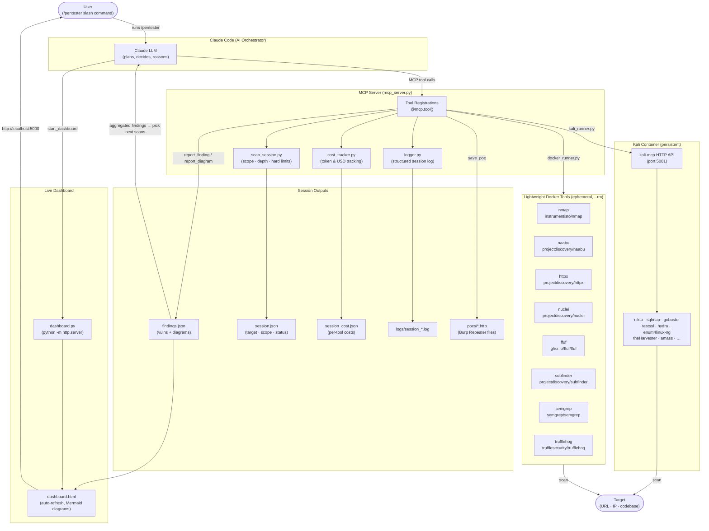

# pentest-agent

A penetration testing agent that uses **Claude as the orchestrator** and spins up Docker containers on demand for each security tool. Includes security analysis skills for CVE analysis and threat modeling. Results stream into a live HTML dashboard.

---

## How it works

```
You (/pentester scan target.com)
  └── Claude Code
        └── MCP server (mcp_server.py) — runs locally via Poetry
              ├── docker run --rm instrumentisto/nmap …
              ├── docker run --rm projectdiscovery/nuclei …
              ├── docker run --rm projectdiscovery/httpx …
              └── persistent kali-mcp container (for kali_exec)
```

Claude decides which tools to run, in what order, and when to stop. Hard limits (cost / time / call count) are enforced server-side — when any limit is hit the tool returns a stop signal and Claude writes the final report.

---

## Skills

Four skills cover different security workflows. They can be used independently or chained together during an engagement.

| Skill | Command | Use case |
|-------|---------|----------|
| **Pentester** | `/pentester scan target.com` | Full penetration test — recon, scanning, exploitation, reporting |
| **CVE Analysis** | `/analyze-cve lodash 4.17.20 CVE-2021-...` | Trace CVE exploitability in your codebase with dataflow analysis and Burp PoC |
| **Threat Model** | `/threat-model` | PASTA framework threat model with STRIDE, attack trees, and risk register |
| **Aikido Triage** | `/aikido-triage findings.csv /path/to/codebase` | Triage every Aikido finding against the codebase — reads flagged files, verdicts each as KEEP OPEN or CLOSE with code evidence, outputs a reviewed CSV and self-contained HTML report |
| **GH Export** | `/gh-export` | Format all confirmed findings from findings.json as copy-pasteable GitHub issue blocks, following the AppSec reporting guide template |

### Chaining skills

- During a pentest, if a CVE is found → run `/analyze-cve` to check if it's exploitable in context
- Before a pentest → run `/threat-model` to identify high-risk areas to focus on
- After a codebase scan → use `/analyze-cve` for findings that need deeper dataflow analysis
- After a pentest with an Aikido CSV export → run `/aikido-triage` to produce a client-ready evidence report
- At the end of any pentest or triage → run `/gh-export` to get copy-pasteable GitHub issue blocks for every finding

---

## Architecture



---

## Requirements

| Dependency | Install |
|------------|---------|
| [Docker Desktop](https://www.docker.com/products/docker-desktop/) | must be running |
| [Poetry](https://python-poetry.org) | `curl -sSL https://install.python-poetry.org \| python3 -` |
| [Claude Code](https://docs.anthropic.com/en/docs/claude-code) | `npm install -g @anthropic-ai/claude-code` |

---

## Installation

```bash
git clone <repo-url>
cd pentest-agent-lightweight
./installers/install.sh
```

`install.sh` does five things:
1. Runs `poetry install` to set up Python dependencies
2. Registers the MCP server with Claude Code (`--scope user` — applies to all sessions)
3. Installs `/pentester` as a global slash command in `~/.claude/commands/`
4. Installs `/analyze-cve`, `/threat-model`, and `/aikido-triage` as skills in `~/.claude/skills/`
5. Adds `mcp__pentest-agent__*` to `~/.claude/settings.json` so tools run without approval prompts

### Optional: pre-pull Docker images

Saves time on the first scan (otherwise images are pulled on first use):

```bash
docker pull instrumentisto/nmap \
           projectdiscovery/naabu \
           projectdiscovery/httpx \
           projectdiscovery/nuclei \
           ghcr.io/ffuf/ffuf \
           projectdiscovery/subfinder \
           semgrep/semgrep \
           trufflesecurity/trufflehog
```

### Optional: build the Kali image

Required only for `kali_exec` (nikto, sqlmap, gobuster, testssl, hydra, etc.):

```bash
docker build -t pentest-agent/kali-mcp ./tools/kali/
```

This takes ~10 minutes on first build. The image is ~3 GB.

---

## Usage

Open any Claude Code session and run:

```
/pentester scan https://example.com
/pentester scan 192.168.1.0/24 depth=recon
/pentester check codebase at /path/to/project
/analyze-cve pymupdf 1.26.4 https://nvd.nist.gov/vuln/detail/CVE-2024-12345
/threat-model
/aikido-triage ~/Downloads/findings.csv /path/to/codebase
```

### Depth presets (pentester)

| Depth | Tools | Default limits |
|-------|-------|----------------|
| `recon` | port scan · subdomains · HTTP probe | $0.10 · 15 min · 10 calls |
| `standard` | recon + nuclei vuln scan + dir fuzzing | $0.50 · 45 min · 25 calls |
| `thorough` | standard + full Kali toolchain | $2.00 · 120 min · 60 calls |

Custom limits override the preset:

```
/pentester scan example.com depth=standard max_cost_usd=0.25 max_time_minutes=20
```

### Live dashboard

Claude calls `start_dashboard` automatically. Open the URL it returns (default `http://localhost:5000/dashboard.html`) to see:

- Findings table (color-coded by severity, expandable evidence)
- Architecture / network diagrams (Mermaid)
- Live cost estimate and per-tool token breakdown
- Scan progress gauges (cost · time · calls vs limits)

### Aikido CSV triage

At the end of a pentest, if you have an Aikido SAST/SCA CSV export:

```
/aikido-triage ~/Downloads/findings.csv /path/to/codebase
```

The skill reads every flagged file, traces each finding's code path, and produces:

| Output | Description |
|--------|-------------|
| `findings-reviewed.csv` | Lean CSV with `recommended_action`, `close_category`, `analyst_notes`, `evidence` columns added |
| `project-security-review.html` | Self-contained HTML report with stats bar, full summary table, and per-finding evidence cards with syntax-highlighted code snippets |

**Verdicts assigned per finding type:**

| Finding type | Investigation | Possible verdicts |
|---|---|---|
| `leaked_secret` | Does file exist? Read flagged lines. | False Positive · File Removed · Hardcoded Secret |
| `sast` NoSQL | Trace call chain to actual DB driver | False Positive (if HTTP client, not NoSQL) |
| `sast` SQLi | Read raw SQL, check interpolation + type coercion | Real Finding (High/Medium) |
| `sast` Actions | SHA pin vs tag pin | Real Finding if tag-pinned |
| `open_source` | Grep app source for imports; check if vulnerable function called | Not Exploitable · Real Finding |
| `eol` | Read version file, check EOL date | Real Finding if EOL passed |

Complex SCA findings are automatically handed off to `/analyze-cve` for full dataflow tracing.

---

## Project structure

```
mcp_server.py          — MCP tool registrations (thin wrappers, entry point)
dashboard.html         — self-refreshing findings dashboard (served by start_dashboard)

core/                  — server infrastructure
  session.py           — scan scope, depth presets, hard limit enforcement
  cost.py              — per-tool token/cost estimation → session_cost.json
  logger.py            — structured session log → logs/session_*.log
  findings.py          — findings.json read/write (findings + Mermaid diagrams)
  dashboard.py         — python -m http.server wrapper

tools/                 — security scanner definitions + Docker runners
  __init__.py          — tool registry
  base.py              — Tool dataclass
  docker_runner.py     — async docker run --rm wrapper
  kali_runner.py       — persistent kali-mcp container lifecycle
  nmap.py              — port scanner
  naabu.py             — fast port scanner
  httpx.py             — HTTP probe
  nuclei.py            — template vulnerability scanner
  ffuf.py              — directory/file fuzzer
  subfinder.py         — subdomain discovery
  semgrep.py           — static code analysis
  trufflehog.py        — secret/credential scanner
  kali/
    Dockerfile         — Kali image (installs mcp-kali-server + all tools)

skills/                — skill & command definitions
  pentester.md         — /pentester slash command (installed to ~/.claude/commands/)
  analyze-cve/
    SKILL.md           — /analyze-cve skill: CVE exploitability analysis with PoC generation
  threat-model/
    SKILL.md           — /threat-model skill: PASTA framework threat modeling
  aikido-triage/
    SKILL.md           — /aikido-triage skill: Aikido CSV triage → reviewed CSV + HTML evidence report

examples/              — reference reports
  threat-model-payflow-app.md    — example PASTA threat model report (markdown)
  threat-model-payflow-app.html  — example PASTA threat model report (styled HTML)

installers/            — setup scripts
  install.sh           — one-command setup (MCP + skills + permissions)
  install_opencode.sh  — opencode variant
  uninstall.sh         — removes MCP registration, skills, and slash command
```

### Adding a new tool

1. Create `tools/mytool.py` following the pattern of any existing tool file
2. Add one import + one entry to `tools/__init__.py`
3. Add a `@mcp.tool()` wrapper in `mcp_server.py`

### Adding a new skill

1. Create `skills/my-skill/SKILL.md` with the skill definition (YAML frontmatter + instructions)
2. Add a `cp` line in `installers/install.sh` to install it to `~/.claude/skills/`
3. Reference it in `CLAUDE.md` so the agent knows when to use it

---

## Session output files

| File | Contents |
|------|----------|
| `findings.json` | all logged findings + Mermaid diagrams |
| `session.json` | target, depth, scope, limits, status |
| `session_cost.json` | per-tool token counts and USD estimate |
| `logs/session_*.log` | structured log of every tool call, result, and reasoning note |

These are excluded from git (see `.gitignore`).

---

## Uninstall

```bash
./installers/uninstall.sh
```

Removes the MCP registration, `/pentester` command, and all installed skills. Docker images are left in place.
