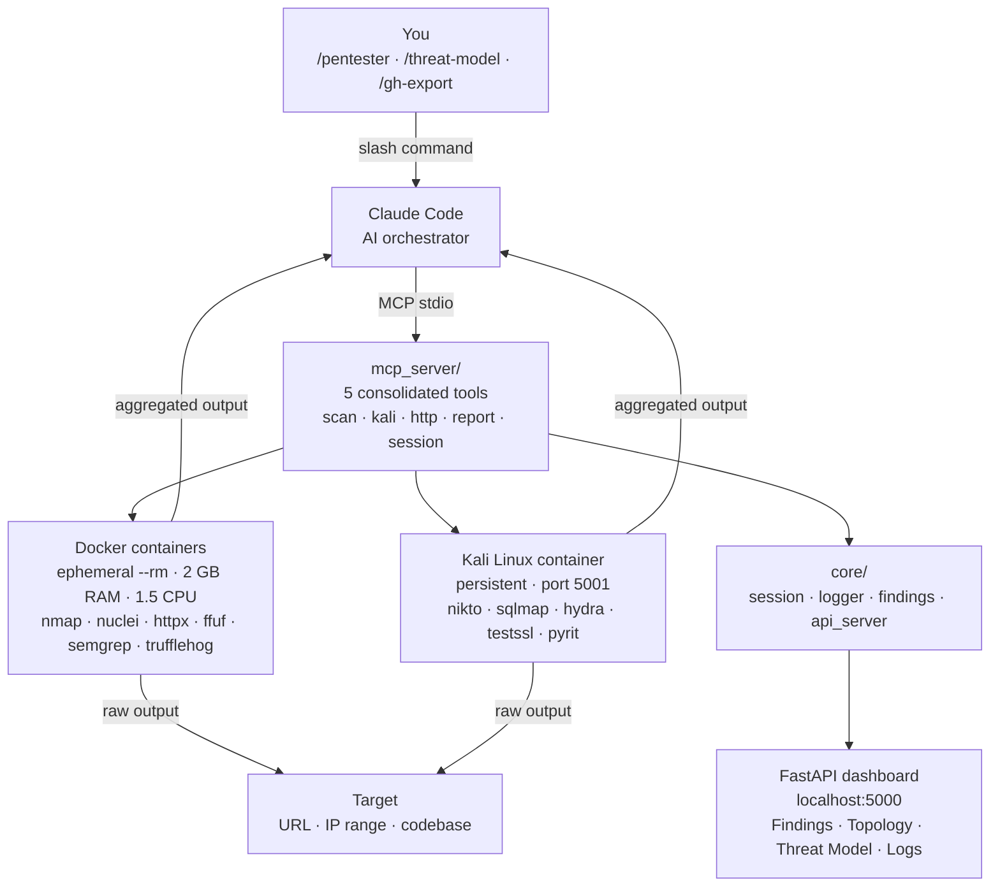

# agent-smith

[](https://sonarcloud.io/summary/new_code?id=0x0pointer_agent-smith) [](https://sonarcloud.io/summary/new_code?id=0x0pointer_agent-smith) [](https://sonarcloud.io/summary/new_code?id=0x0pointer_agent-smith)

> **For authorized security testing only.**
> Only use this tool against systems you own or have explicit written permission to test.
> Unauthorized access to computer systems is illegal and unethical.

An AI-driven penetration testing agent. Claude acts as the orchestrator — it decides which tools to run, in what order, and when to stop. Security tools run inside ephemeral Docker containers or a persistent Kali Linux container. Results stream into a live dashboard.

Licensed under the [MIT License](LICENSE).

---

## How it works

```
You (/pentester scan target.com)
  └── Claude Code
        └── MCP server (python -m mcp_server)
              ├── Lightweight tools — docker run --rm (nmap, nuclei, httpx, …)
              ├── Kali container    — persistent kali-mcp (nikto, sqlmap, ffuf, …)
              └── FastAPI dashboard — live findings at http://localhost:5000
```

Claude decides what to run. Each tool's output is aggregated and returned to Claude, which interprets the results and decides the next action — pivoting to deeper scans, skipping dead ends, or reporting findings. Hard limits (cost / time / call count) are enforced server-side — when any limit is hit, the tool returns a stop signal and Claude writes the final report.

---

## Architecture



---

## Quick start

### Requirements

| Dependency | Install |
|---|---|
| [Docker Desktop](https://www.docker.com/products/docker-desktop/) | must be running |
| [Poetry](https://python-poetry.org) | `curl -sSL https://install.python-poetry.org \| python3 -` |
| [Claude Code](https://docs.anthropic.com/en/docs/claude-code) | `npm install -g @anthropic-ai/claude-code` |
| [Node.js](https://nodejs.org) v18+ | optional — enables server-side Mermaid pre-rendering; diagrams fall back to client-side rendering without it |

### Install

```bash
git clone --recursive <repo-url>
cd agent-smith
./installers/install.sh
```

The `--recursive` flag pulls the [skills submodule](https://github.com/0x0pointer/skills) automatically. The installer handles everything else: Poetry dependencies, API key prompts, MCP registration, and skill installation.

> **Already cloned without `--recursive`?** Run `git submodule update --init --recursive` to pull the skills.

> **After install, fully quit and reopen Claude Code.** The MCP server connects at startup — tools won't be available until you do this.

### Run

Open Claude Code and use a slash command:

```
/pentester scan https://example.com
/pentester scan 192.168.1.0/24 depth=recon
/pentester check codebase at /path/to/project
/threat-model
/analyze-cve lodash 4.17.20 CVE-2021-23337
/aikido-triage ~/Downloads/findings.csv /path/to/codebase
/ai-redteam https://ai-app.com/api/chat provider=openai depth=standard
```

Claude calls `start_dashboard` automatically. Open `http://localhost:5000` to watch findings appear in real time.

### Optional: build the Kali image

Required for `kali_exec`, `run_ffuf`, `run_spider`, and `run_pyrit`:

```bash
docker build -t pentest-agent/kali-mcp ./tools/kali/
```

~10 minutes, ~3 GB. Includes PyRIT, ffuf, katana, sqlmap, nikto, and ~50 other tools.

---

## Project layout

```
mcp_server/              MCP tool layer — 5 consolidated tools (Claude-callable)
  __main__.py            entry point  →  python -m mcp_server
  _app.py                FastMCP singleton + shared helpers (_run, _clip)
  scan_tools.py          scan()    — nmap · naabu · httpx · nuclei · ffuf · spider
                                     subfinder · semgrep · trufflehog · fuzzyai · pyrit
  kali_tools.py          kali()    — freeform commands in the Kali container
  http_tools.py          http()    — raw HTTP requests + PoC saving
  report_tools.py        report()  — findings · diagrams · notes · dashboard
  session_tools.py       session() — scan lifecycle · Kali infra · codebase target

core/                    Server infrastructure
  session.py             Scan scope, depth presets, hard limit enforcement
  logger.py              Structured session log → logs/pentest.log
  findings.py            findings.json read/write (findings + diagrams)
  api_server.py          FastAPI web server (dashboard + REST API)

tools/                   Docker tool definitions + runners
  base.py                Tool dataclass
  docker_runner.py       Async docker run --rm wrapper (--memory=2g --cpus=1.5)
  kali_runner.py         Persistent Kali container lifecycle
  nmap / naabu / httpx / nuclei / subfinder / semgrep / trufflehog / fuzzyai

tools/kali/              Kali image
  Dockerfile             Builds pentest-agent/kali-mcp
  pyrit_runner.py        CLI shim for Microsoft PyRIT

skills/                  Slash command definitions (git submodule → github.com/0x0pointer/skills)
  pentester.md
  analyze-cve/SKILL.md
  threat-modeling/SKILL.md
  aikido-triage/SKILL.md
  gh-export/SKILL.md
  ai-redteam/SKILL.md

templates/
  dashboard.html         4-tab dashboard (Findings · Topology · Threat Model · Logs)

threat-model/            Threat model reports (*.md) — auto-displayed in the Threat Model tab

installers/              install.sh · uninstall.sh
```

---

## Documentation

| Doc | Contents |
|---|---|
| [docs/tools.md](docs/tools.md) | All MCP tools — parameters, purpose, examples |
| [docs/kali-toolchain.md](docs/kali-toolchain.md) | Full `kali_exec` command reference |
| [docs/skills.md](docs/skills.md) | Slash commands, chaining guide, examples |
| [docs/dashboard-api.md](docs/dashboard-api.md) | FastAPI endpoints, response shapes |
| [docs/extending.md](docs/extending.md) | How to add new tools and skills |

> **Adding a new skill?** Skills live in a separate repo ([github.com/0x0pointer/skills](https://github.com/0x0pointer/skills)) pulled in as a git submodule. After adding a skill there, update the submodule pointer (`git add skills && git commit`) and re-run `./installers/install.sh` to deploy it to `~/.claude/skills/`.
| [docs/testing.md](docs/testing.md) | Running the test suite, coverage, adding new tests |
