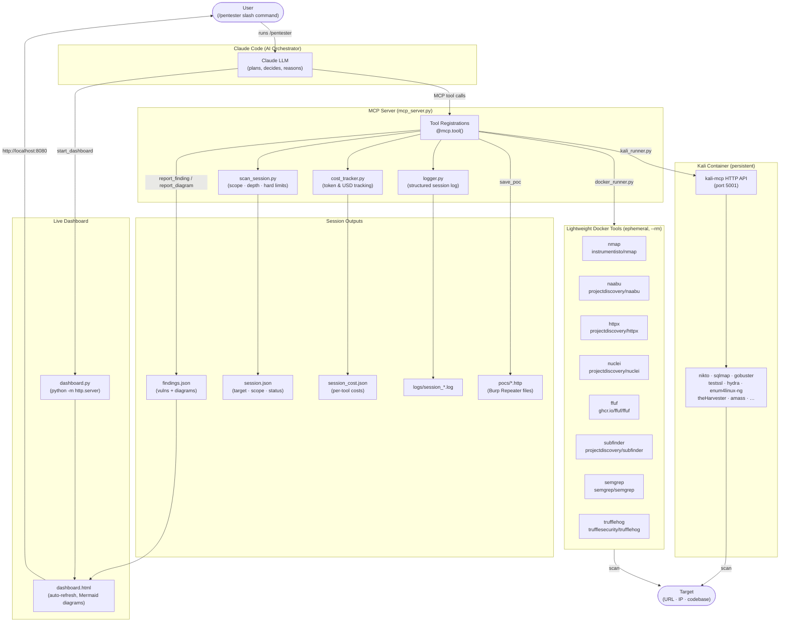

# pentest-agent

A lightweight penetration testing agent that uses **Claude as the orchestrator** and spins up Docker containers on demand for each security tool. Results stream into a live HTML dashboard. Every decision, tool call, and finding is logged.

---

## How it works

```
You (/pentester scan target.com)
  └── Claude Code
        └── MCP server (mcp_server.py) — runs locally via Poetry
              ├── docker run --rm instrumentisto/nmap …
              ├── docker run --rm projectdiscovery/nuclei …
              ├── docker run --rm projectdiscovery/httpx …
              └── persistent kali-mcp container (for kali_exec)
```

Claude decides which tools to run, in what order, and when to stop. Hard limits (cost / time / call count) are enforced server-side — when any limit is hit the tool returns a stop signal and Claude writes the final report.

---

## Architecture



### Component breakdown

| Component | File(s) | Role |
|-----------|---------|------|
| **Claude LLM** | — | AI orchestrator: plans the attack sequence, interprets results, decides what to run next, writes findings |
| **MCP Server** | `mcp_server.py` | Thin `@mcp.tool()` wrappers that expose every capability to Claude as callable tools over the Model Context Protocol |
| **Scan Session** | `scan_session.py` | Tracks target scope, depth preset, and enforces hard limits (max cost / time / calls); returns a stop signal when any limit is hit |
| **Cost Tracker** | `cost_tracker.py` | Estimates token usage and USD cost per tool call; writes `session_cost.json` |
| **Logger** | `logger.py` | Writes a structured JSONL log of every tool invocation, result, and Claude reasoning note to `logs/` |
| **Docker Runner** | `tools/docker_runner.py` | `async docker run --rm` wrapper; streams stdout/stderr back to the MCP server |
| **Lightweight tools** | `tools/nmap.py` … | One file per tool — builds the CLI args and calls docker_runner; each runs in its own ephemeral container |
| **Kali Runner** | `tools/kali_runner.py` | Manages a single persistent `pentest-agent/kali-mcp` container; routes commands to its HTTP API on port 5001 to avoid per-command container startup overhead |
| **Findings store** | `tools/findings.py` | Reads/writes `findings.json`; holds confirmed vulnerabilities and Mermaid topology diagrams |
| **Dashboard** | `tools/dashboard.py`, `dashboard.html` | Serves `dashboard.html` via a local HTTP server; the page auto-refreshes and renders findings, diagrams, cost gauges, and scan progress |

---

## Requirements

| Dependency | Install |
|------------|---------|
| [Docker Desktop](https://www.docker.com/products/docker-desktop/) | must be running |
| [Poetry](https://python-poetry.org) | `curl -sSL https://install.python-poetry.org \| python3 -` |
| [Claude Code](https://docs.anthropic.com/en/docs/claude-code) | `npm install -g @anthropic-ai/claude-code` |

---

## Installation

```bash
git clone <repo-url>
cd pentest-agent-lightweight
./installers/install.sh
```

`install.sh` does four things:
1. Runs `poetry install` to set up Python dependencies
2. Registers the MCP server with Claude Code (`--scope user` — applies to all sessions)
3. Installs `/pentester` as a global slash command in `~/.claude/commands/`
4. Adds `mcp__pentest-agent__*` to `~/.claude/settings.json` so tools run without approval prompts

### Optional: pre-pull Docker images

Saves time on the first scan (otherwise images are pulled on first use):

```bash
# Lightweight tools — pulled from Docker Hub
docker pull instrumentisto/nmap \
           projectdiscovery/naabu \
           projectdiscovery/httpx \
           projectdiscovery/nuclei \
           ghcr.io/ffuf/ffuf \
           projectdiscovery/subfinder \
           semgrep/semgrep \
           trufflesecurity/trufflehog
```

### Optional: build the Kali image

Required only for `kali_exec` (nikto, sqlmap, gobuster, testssl, hydra, etc.):

```bash
docker build -t pentest-agent/kali-mcp ./tools/kali/
```

This takes ~10 minutes on first build. The image is ~3 GB.

---

## Usage

Open any Claude Code session and run:

```
/pentester scan https://example.com
/pentester scan 192.168.1.0/24 depth=recon
/pentester check codebase at /path/to/project
```

Claude will ask which depth/limits to use if you don't specify them, then start scanning.

### Depth presets

| Depth | Tools | Default limits |
|-------|-------|----------------|
| `recon` | port scan · subdomains · HTTP probe | $0.10 · 15 min · 10 calls |
| `standard` | recon + nuclei vuln scan + dir fuzzing | $0.50 · 45 min · 25 calls |
| `thorough` | standard + full Kali toolchain | $2.00 · 120 min · 60 calls |

Custom limits override the preset:

```
/pentester scan example.com depth=standard max_cost_usd=0.25 max_time_minutes=20
```

### Live dashboard

Claude calls `start_dashboard` automatically. Open the URL it returns (default `http://localhost:8080/dashboard.html`) to see:

- Findings table (color-coded by severity, expandable evidence)
- Architecture / network diagrams (Mermaid)
- Live cost estimate and per-tool token breakdown
- Scan progress gauges (cost · time · calls vs limits)

---

## Project structure

```
mcp_server.py          — MCP tool registrations (thin wrappers only)
scan_session.py        — scan scope, depth presets, hard limit enforcement
cost_tracker.py        — per-tool token/cost estimation → session_cost.json
logger.py              — structured session log → logs/session_*.log
dashboard.html         — self-refreshing findings dashboard (served by start_dashboard)

tools/
  base.py              — Tool dataclass
  docker_runner.py     — async docker run --rm wrapper
  kali_runner.py       — persistent kali-mcp container lifecycle
  findings.py          — findings.json read/write (findings + Mermaid diagrams)
  dashboard.py         — python -m http.server wrapper
  nmap.py              — port scanner
  naabu.py             — fast port scanner
  httpx.py             — HTTP probe
  nuclei.py            — template vulnerability scanner
  ffuf.py              — directory/file fuzzer
  subfinder.py         — subdomain discovery
  semgrep.py           — static code analysis
  trufflehog.py        — secret/credential scanner
  kali/
    Dockerfile         — Kali image (installs mcp-kali-server + all tools)

commands/
  pentester.md         — /pentester slash command definition (copied to ~/.claude/commands/ by install.sh)

installers/
  install.sh           — one-command setup
  uninstall.sh         — removes MCP registration and slash command
```

### Adding a new tool

1. Create `tools/mytool.py` following the pattern of any existing tool file
2. Add one import + one entry to `tools/__init__.py`
3. Add a `@mcp.tool()` wrapper in `mcp_server.py`

---

## Session output files

| File | Contents |
|------|----------|
| `findings.json` | all logged findings + Mermaid diagrams |
| `session.json` | target, depth, scope, limits, status |
| `session_cost.json` | per-tool token counts and USD estimate |
| `logs/session_*.log` | structured log of every tool call, result, and reasoning note |

These are excluded from git (see `.gitignore`).

---

## Uninstall

```bash
./installers/uninstall.sh
```

Removes the MCP registration and the `/pentester` slash command. Docker images are left in place.
