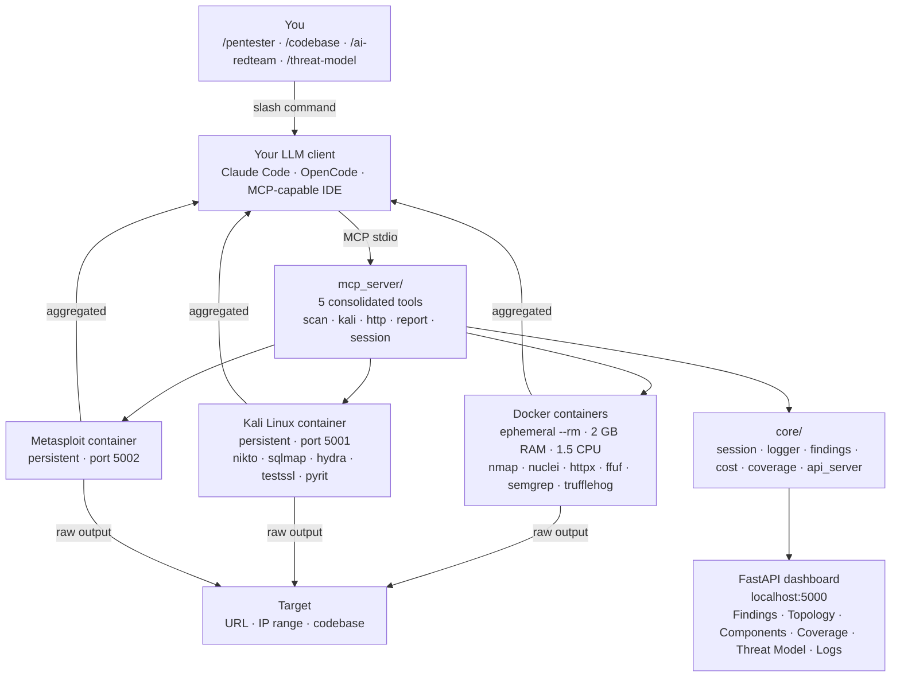
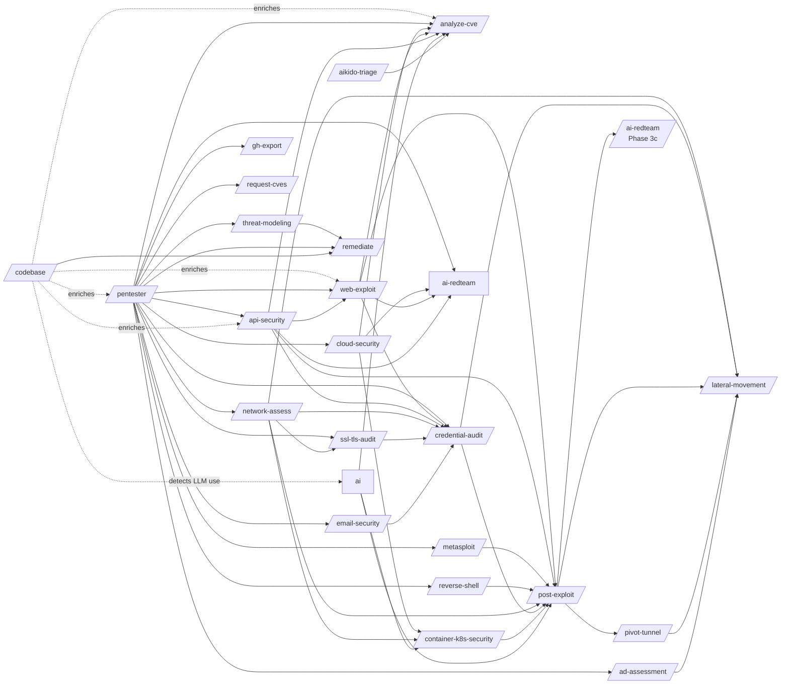

<p align="center">
  
</p>

# agent-smith

[](https://sonarcloud.io/summary/new_code?id=0x0pointer_agent-smith) [](https://sonarcloud.io/summary/new_code?id=0x0pointer_agent-smith) [](https://sonarcloud.io/summary/new_code?id=0x0pointer_agent-smith)

**An AI-driven offensive-security agent that thinks for itself.**
You bring the LLM. agent-smith brings the tools, the skills, and the methodology and the LLM does the rest.

> ⚠️ **Authorized testing only.** Use against systems you own or have explicit written permission to test. Unauthorized access is illegal.

<p align="center">
  
</p>

---

## Why agent-smith

- 🧠 **The LLM is the brain, not a payload library.** 


Skills teach *methodology*; the LLM invents the actual attacks. No two scans look 100% alike.
- 🔗 **Skills chain themselves.** 


`/pentester` discovers an injection point and pivots into `/web-exploit`; `/codebase` finds an LLM call site and pivots into `/ai-redteam`. The agent decides what to run next based on what it just found.
- 🛠 **Bring your own LLM.** 


Works with Claude Code, [OpenCode](https://opencode.ai) (any provider — OpenAI, Gemini, Ollama, OpenRouter, local models), or any MCP-capable client.
- 📦 **End-to-end deliverables.** 


Findings, PoCs (Burp-ready `.http` files), threat models, code patches, GitHub issues, and CVE submission packages all generated for you.
- 🐳 **Sandboxed by default.** 


Every scanner runs inside an ephemeral Docker container. Hard cost / time / call-count limits enforced server-side.
- 📊 **Live dashboard.** 


Watch findings, topology, coverage, and the threat model populate in real time at `localhost:5000`.

---

## The new way: skills as pattern teachings

Most pentest automation ships a giant payload library and runs it linearly. agent-smith does the opposite.

**Skills are not scripts. Skills are prompts that teach the LLM a way of *thinking*.** They describe the vulnerability class, the surface area, the verification logic, and the chaining rules but they leave the actual attacks to the model. The LLM reads the skill, understands the *pattern*, and then finds its own paths through your target.

This means:

| Traditional Security tools | agent-smith |
|---|---|
| Fixed payload list | Us: LLM-generated payloads, contextual to each target |
| One tool per phase | Skills compose — `/codebase` enriches `/pentester`, which enriches `/post-exploit` |
| Stops at first success | Keeps probing until the cost / time / coverage budget is hit |
| Generates a PDF | Generates findings, PoCs, patches, threat models, coverage matrix, CVE packages and more...|
| Same scan every time | Two runs against the same target produce different attack paths |

The skills are inspiration. The LLM is the operator.

---

## See it in action

<!-- TODO: drop gifs into docs/gifs/ — paths are already wired up below -->

<table>
  <tr>
    <td width="50%">
      <p align="center"><strong><code>/pentester</code> — full autonomous engagement</strong></p>
      
      <p><sub>Recon → fingerprint → exploit → loot → report. The agent decides every step.</sub></p>
    </td>
    <td width="50%">
      <p align="center"><strong><code>/codebase</code> — white-box ASVS review</strong></p>
      
      <p><sub>Source → routes → sinks → ASVS chapters → enriched context for every downstream skill.</sub></p>
    </td>
  </tr>
  <tr>
    <td width="50%">
      <p align="center"><strong><code>/ai-redteam</code> — OWASP LLM Top 10 + AITG</strong></p>
      
      <p><sub>Prompt injection, jailbreaks, model extraction, MCP runtime attacks, and post-access infra checks.</sub></p>
    </td>
    <td width="50%">
      <p align="center"><strong><code>/remediate</code> — auto-generated patches</strong></p>
      
      <p><sub>For every confirmed finding the agent writes a code or config patch and verifies it doesn't break the build.</sub></p>
    </td>
  </tr>
</table>

---

## Use cases

Drop in any of these the moment you start your client/agent. No setup beyond `./installers/install.sh`

Below are the skills you can use in your OpenCode or Claude Code, these are just a couple examples and use cases as we have more then 25+ Cyber Security skills.

### 1. Run a full pentest, hands-off

```
/pentester scan https://staging.example.com depth=thorough
```

The agent runs OSINT → recon → web exploit → post-exploit → reporting, deciding each pivot from the previous result. End state: `findings.json`, PoCs in `pocs/`, a topology diagram, a coverage matrix, and a patch ready code fix.

### 2. Pre-prod secure code review

```
/codebase path=./src
```

White-box ASVS 5.0 review across 16 chapters and 427 requirements. Maps every route, every sink, every dangerous pattern. 

### 3. Triage a CVE in your dependency tree

```
/analyze-cve lodash 4.17.20 CVE-2021-23337
```

The agent reads your code, traces the vulnerable function from user input to sink, decides whether you're actually exploitable, and writes a Burp-ready PoC if you are.

### 4. AI / LLM red-team

```
/ai-redteam https://your-app.com/api/chat provider=openai depth=thorough
```

Covers OWASP LLM Top 10 (2025), the OWASP AI Testing Guide (AITG v1, Nov 2025), and OWASP MCP Top 10 runtime attacks. Generates payloads on the fly using FuzzyAI, Garak, PyRIT, and promptfoo.

### 5. Build a CVE submission package

```
/request-cves
```

After a pentest the agent generates the MITRE CVE form, a GitHub Security Advisory draft, a full disclosure report, and a vendor notification email — for every qualifying finding.

### 6. Threat-model an architecture

```
/threat-modeling
```

PASTA + STRIDE + 4-question framework. Outputs component map, data flow diagram, attack tree, prioritized risk register, and a mitigation plan.

> 💡 **Pick a skill or let `/pentester` orchestrate.** Single-purpose skills give you laser focus; `/pentester` chains everything based on what it finds.

---

## Quick start

### Requirements

| Dependency | Notes |
|---|---|
| [Docker Desktop](https://www.docker.com/products/docker-desktop/) | Must be running. All scanners are sandboxed. |
| [Poetry](https://python-poetry.org) | `curl -sSL https://install.python-poetry.org \| python3 -` |
| **One LLM client** (pick one) | See below ↓ |
| [Node.js](https://nodejs.org) v18+ | Optional — enables server-side Mermaid pre-rendering. |

### Pick your LLM client

agent-smith ships an MCP server. Anything that speaks MCP can drive it.

<table>
  <tr>
    <th width="33%">Claude Code</th>
    <th width="33%">OpenCode (BYO LLM)</th>
    <th width="33%">Custom MCP client</th>
  </tr>
  <tr>
    <td>
      Anthropic's official CLI. Best UX, native skill support.
      <pre><code>git clone --recursive &lt;repo&gt;
cd agent-smith
./installers/install.sh</code></pre>
      Requires <a href="https://docs.anthropic.com/en/docs/claude-code">Claude Code</a> + an Anthropic API key.
    </td>
    <td>
      Open-source coding agent that supports <strong>any</strong> provider — OpenAI, Anthropic, Google, OpenRouter, Ollama, llama.cpp, vLLM, your own endpoint.
      <pre><code>git clone --recursive &lt;repo&gt;
cd agent-smith
./installers/install_opencode.sh</code></pre>
      Requires <a href="https://opencode.ai">OpenCode</a>. Configure your model in <code>~/.config/opencode/opencode.json</code>.
    </td>
    <td>
      Any MCP-capable client (Cursor, Continue, Zed, custom Agent SDK app, etc.).
      <pre><code>poetry install
poetry run python -m mcp_server</code></pre>
      Wire the stdio MCP server into your client. Skills are plain markdown in <code>skills/</code> — load them however your client expects prompts.
    </td>
  </tr>
</table>

> 🧠 **The LLM is your choice.** agent-smith doesn't care if it's Claude Opus 4.6, GPT-5, Gemini 2.5, Llama-4, or a local Qwen3 — anything strong enough to follow tool-use instructions will work. Bigger / smarter models find more interesting attack paths.

> ⚠️ **After install, fully restart your client.** The MCP server connects at startup.

### Optional images

```bash
# Kali container — required for /credential-audit, /web-exploit deep tools, etc.
docker build -t pentest-agent/kali-mcp ./tools/kali/      # ~10 min, ~3 GB

# Metasploit container — required for /metasploit
docker build -t pentest-agent/metasploit ./tools/metasploit/   # ~5 min
```

Lightweight tools (nmap, nuclei, httpx, ffuf, semgrep, trufflehog, …) are auto-pulled on first use.

---

## How it works

```
You (/pentester scan target.com)
  └── Your LLM (Claude / GPT / Gemini / local …)
        └── MCP server (python -m mcp_server)
              ├── Lightweight scanners — docker run --rm (nmap, nuclei, httpx, …)
              ├── Kali container       — persistent kali-mcp (nikto, sqlmap, ffuf, …)
              ├── Metasploit container — exploit validation
              └── FastAPI dashboard    — live findings at localhost:5000
```

The LLM decides what to run. Each tool's output is aggregated and returned to the model, which interprets the result and chooses the next action — pivoting deeper, skipping dead ends, or finalizing findings. Hard cost / time / call-count limits are enforced server-side. When any limit fires, the tool returns a stop signal and the agent writes the final report.

### Architecture



---

## Skills

Skills are markdown files that teach the LLM a methodology. They live in the [`skills/` submodule](https://github.com/0x0pointer/skills) and are loaded by your client at startup.

### How they chain



### Catalog

<details>
<summary><strong>Penetration testing</strong></summary>

| Skill | What it does |
|---|---|
| `/pentester` | Full autonomous engagement — chains everything else |
| `/web-exploit` | SQLi, XSS, SSRF, SSTI, deserialization, JWT, smuggling, race conditions, etc. |
| `/api-security` | OWASP API Top 10 (2023) — BOLA, BFLA, mass assignment, JWT/OAuth abuse, SSRF, business-flow abuse, inventory drift. REST/GraphQL/gRPC/SOAP/MCP |
| `/network-assess` | VLAN hopping, LLMNR/NBT-NS, SNMP, segmentation |
| `/post-exploit` | Linux/Windows privesc, persistence, credential harvesting |
| `/lateral-movement` | PTH, PTT, Kerberoasting, NTLM relay, delegation abuse |
| `/metasploit` | Exploit validation in an isolated Docker container |
| `/reverse-shell` | Generates and manages reverse shells across all platforms |
| `/pivot-tunnel` | Chisel + SOCKS5 tunneling after RCE |
</details>

<details>
<summary><strong>Cloud, infra & identity</strong></summary>

| Skill | What it does |
|---|---|
| `/cloud-security` | AWS / Azure / GCP IAM, storage, serverless, logging gaps |
| `/container-k8s-security` | Container escape, K8s RBAC, etcd, service account abuse |
| `/ad-assessment` | ADCS (ESC1–ESC8), BloodHound, GPO, LAPS, forest trusts |
| `/email-security` | SPF / DKIM / DMARC, open relay, MTA-STS, SMTP security |
| `/ssl-tls-audit` | TLS protocol/cipher audit, cert chain, POODLE/BEAST/Heartbleed/etc. |
| `/credential-audit` | Brute force, password spraying, default creds, lockout, MFA bypass |
</details>

<details>
<summary><strong>Recon & analysis</strong></summary>

| Skill | What it does |
|---|---|
| `/osint` | Subdomain takeover, cert transparency, Shodan, leaked creds |
| `/threat-modeling` | PASTA + STRIDE + 4-question, attack tree, risk register |
| `/codebase` | OWASP ASVS 5.0 white-box review (16 chapters, 427 requirements) |
| `/analyze-cve` | CVE code-path tracing + Burp PoC |
| `/aikido-triage` | Triage Aikido SAST/SCA/secret-scan CSV against your code |
</details>

<details>
<summary><strong>AI safety & red-team</strong></summary>

| Skill | What it does |
|---|---|
| `/ai-redteam` | OWASP LLM Top 10 + AITG v1 + MCP Top 10 runtime attacks |
| `/colang-gen` | Generate NeMo Guardrails Colang configs from plain language |
</details>

<details>
<summary><strong>Reporting & remediation</strong></summary>

| Skill | What it does |
|---|---|
| `/remediate` | Writes code patches and config fixes for every finding |
| `/gh-export` | Formats confirmed findings as copy-pasteable GitHub issues |
| `/request-cves` | Generates CVE submission packages — MITRE form, GHSA draft, disclosure report, vendor email |
</details>

---

## What you get out

Every scan produces a structured set of artifacts you can hand to a developer, a manager, or a vendor on day one:

| Artifact | Where | What it's for |
|---|---|---|
| `findings.json` | repo root | Machine-readable findings + diagrams |
| `pocs/*.http` | repo root | Raw HTTP PoCs (open in Burp Repeater) |
| Live dashboard | `localhost:5000` | Findings, Topology, Components, Coverage, Threat Model, Logs |
| Coverage matrix | dashboard tab | Endpoint × technique tracking — proves what you tested |
| Code patches | inline edits | One per finding, generated by `/remediate` |
| Threat model | `threat-model/*.md` | PASTA + STRIDE write-up + diagrams |
| CVE packages | via `/request-cves` | MITRE form, GHSA draft, vendor email, full disclosure |
| Session log | `logs/pentest.log` | Full audit trail of what the agent decided and why |

---

## Project layout

<details>
<summary>Click to expand</summary>

```
mcp_server/              MCP tool layer — 5 consolidated tools (LLM-callable)
  __main__.py            entry point  →  python -m mcp_server
  _app.py                FastMCP singleton + shared helpers (_run, _clip)
  scan_tools.py          scan()    — nmap · naabu · httpx · nuclei · ffuf · spider
                                     subfinder · semgrep · trufflehog · fuzzyai · pyrit
                                     garak · promptfoo · metasploit
  kali_tools.py          kali()    — freeform commands in the Kali container
  http_tools.py          http()    — raw HTTP requests + PoC saving
  report_tools.py        report()  — findings · diagrams · notes · dashboard · coverage
  session_tools.py       session() — scan lifecycle · Kali infra · codebase target

core/                    Server infrastructure
  session.py             Scan scope, depth presets, hard limit enforcement
  logger.py              Structured session log → logs/pentest.log
  findings.py            findings.json read/write
  cost.py                Cost tracking per tool invocation
  coverage.py            Endpoint × technique coverage matrix
  api_server.py          FastAPI web server (dashboard + REST API)

tools/                   Docker tool definitions + runners
  base.py · docker_runner.py · kali_runner.py · metasploit_runner.py
  nmap / naabu / httpx / nuclei / ffuf / subfinder / semgrep / trufflehog / fuzzyai

tools/kali/              Kali image (Dockerfile + pyrit_runner.py)
tools/metasploit/        Metasploit image (Dockerfile + msfconsole HTTP shim)

skills/                  Slash command definitions (git submodule)
                         24+ skills covering recon → exploit → report → remediate

templates/dashboard.html 6-tab dashboard
threat-model/            Threat model reports (auto-displayed in the dashboard)
tests/                   pytest suite
logs/                    Session logs
pocs/                    Saved proof-of-concept HTTP requests
docs/gifs/               Demo gifs (drop your recordings here)

installers/
  install.sh                     Claude Code installer
  install_opencode.sh            OpenCode installer (BYO LLM)
  uninstall.sh                   Remove MCP config and installed skills
  opencode-pentest-recovery.mjs  Compaction recovery plugin for OpenCode
```
</details>

---

## Documentation

| Doc | Contents |
|---|---|
| [docs/tools.md](docs/tools.md) | All MCP tools — parameters, purpose, examples |
| [docs/kali-toolchain.md](docs/kali-toolchain.md) | Full `kali` command reference |
| [docs/skills.md](docs/skills.md) | Slash commands, chaining guide, examples |
| [docs/dashboard-api.md](docs/dashboard-api.md) | FastAPI endpoints, response shapes |
| [docs/extending.md](docs/extending.md) | How to add new tools and skills |
| [docs/testing.md](docs/testing.md) | Running the test suite, coverage, adding tests |

> **Adding a new skill?** Skills live in a separate repo ([github.com/0x0pointer/skills](https://github.com/0x0pointer/skills)) pulled in as a git submodule. After adding a skill there, update the submodule pointer (`git add skills && git commit`) and re-run the installer to deploy it.

---

## License

GNU Affero General Public License v3.0 — see [LICENSE](LICENSE).

> Built for offensive-security professionals. Use it to make the internet safer.
