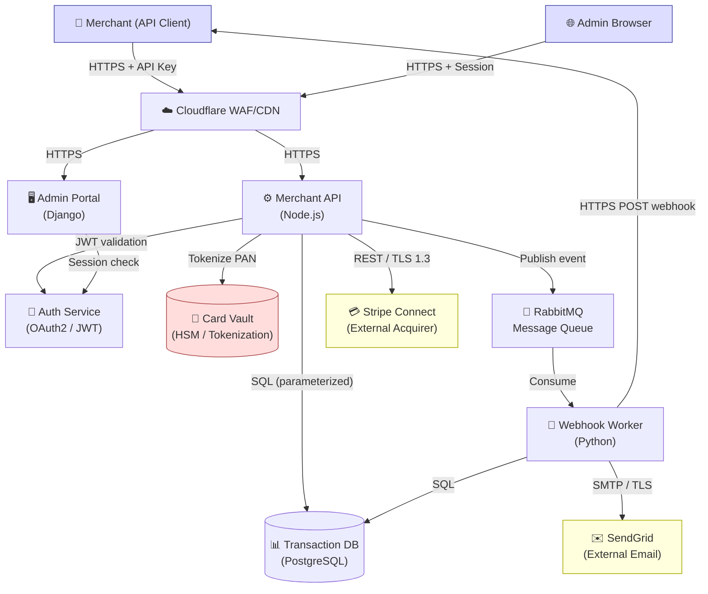
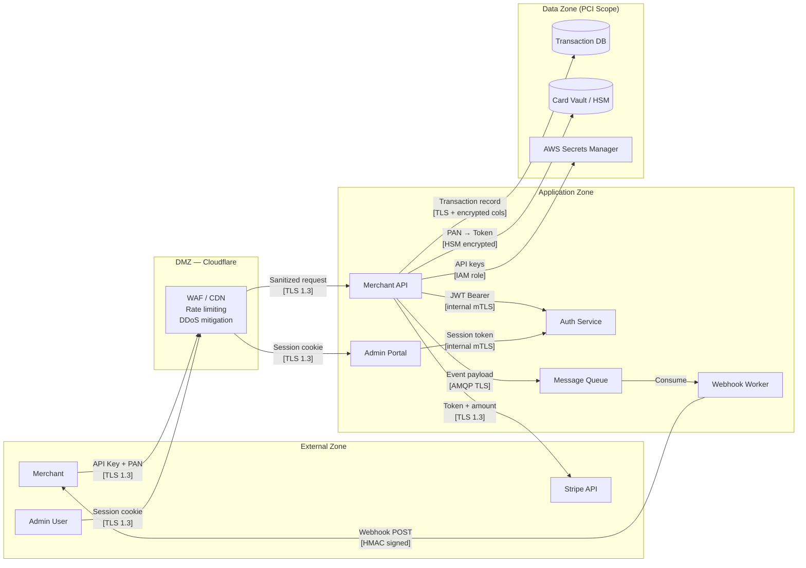
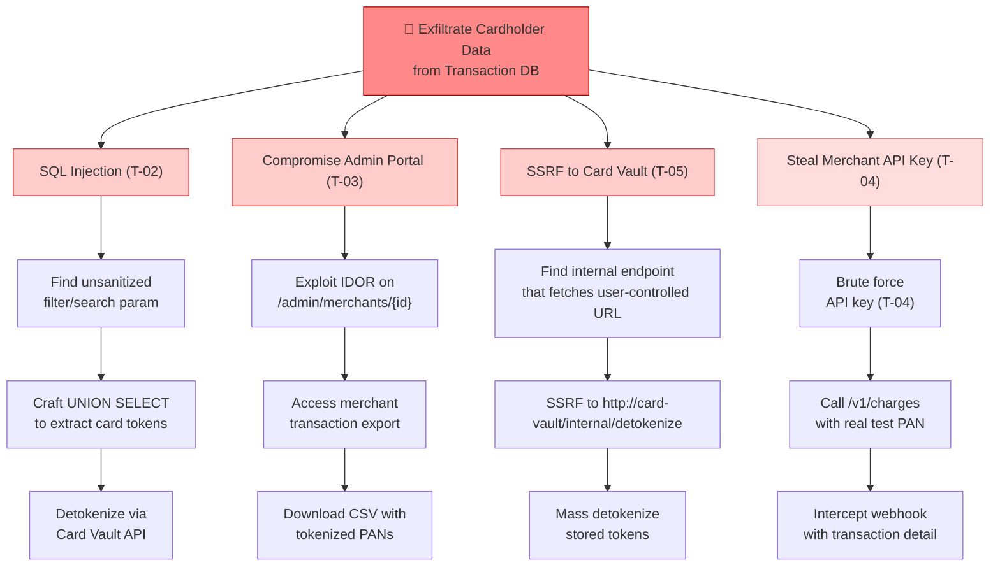
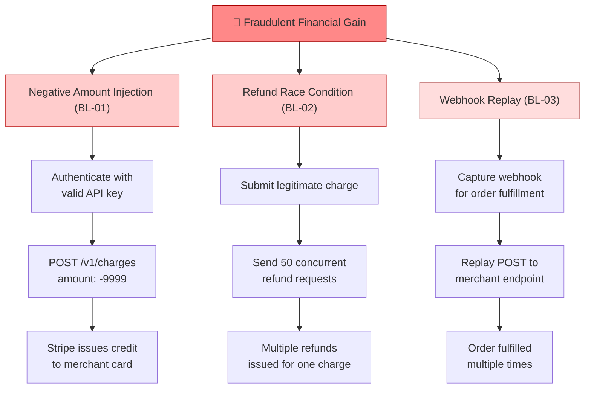

# Threat Model: PayFlow SaaS Payment Platform

**Date**: 2026-03-02
**Framework**: PASTA · Shostack 4-Question Method
**Scope**: Web API + Admin Portal + Payment Processing Pipeline
**Findings**: 3 Critical · 5 High · 4 Medium · 2 Low

---

## Shostack Session Summary

| Question | Answer |
|----------|--------|
| What are we working on? | A SaaS payment platform that processes card transactions, stores PII, and exposes a REST API to merchant integrations |
| What can go wrong? | Card data exfiltration, account takeover, authorization bypass on admin portal, replay attacks on webhooks, logic manipulation of payment amounts |
| What are we going to do about it? | See Risk Register — immediate fixes to JWT validation and parameterized queries; short-term WAF + SAST in CI; long-term PCI DSS audit |
| Did we do a good job? | Coverage: ✅ Depth: ✅ Actionability: ✅ Business alignment: ✅ |

---

## 1. Objectives & Scope

### Business Objectives
- Process card-not-present transactions on behalf of merchant customers
- Maintain PCI DSS Level 1 compliance (>6M transactions/year)
- Ensure 99.9% API uptime SLA for enterprise merchants
- Protect cardholder data and merchant financial data from breach

### Assets to Protect
- **Cardholder Data (CHD)**: PAN, CVV (transit only), expiry — highest sensitivity
- **Merchant API keys**: Full payment authorization capability if leaked
- **Transaction records**: Financial and PII data, regulatory retention requirements
- **Admin portal access**: Full platform control, all merchant data visible

### Compliance Constraints
- **PCI DSS v4.0** — mandatory for card processing
- **GDPR** — EU merchant and cardholder data
- **SOC 2 Type II** — enterprise customer requirement

### In-Scope Components

| Component | Type | Technology | In Scope? |
|-----------|------|------------|-----------|
| Merchant API | Process | Node.js / Express | ✅ Yes |
| Admin Portal | Process | React + Django | ✅ Yes |
| Auth Service | Process | OAuth2 / JWT | ✅ Yes |
| Transaction DB | Data Store | PostgreSQL 15 | ✅ Yes |
| Card Vault | Data Store | HSM-backed, tokenization | ✅ Yes |
| Message Queue | Process | RabbitMQ | ✅ Yes |
| Webhook Worker | Process | Python worker | ✅ Yes |
| CDN / WAF | Infrastructure | Cloudflare | ✅ Yes |
| Stripe (acquirer) | External | Stripe Connect API | ⚠️ Partial |
| SendGrid | External | Email delivery | ⚠️ Partial |

---

## 2. Component Map

---

## 3. Data Flow Diagram

**Trust Boundaries:**
- `External → DMZ`: All internet-facing traffic; primary DDoS and injection surface
- `DMZ → Application`: Post-WAF; still validate — WAF is not a substitute for input validation
- `Application → Data Zone`: Highest privilege; must be tightly controlled; PCI audit scope
- `Application → External APIs`: Third-party trust; validate all responses; handle failures gracefully

---

## 4. Threat Inventory (STRIDE)

| ID | Component | STRIDE | Threat Description | Likelihood | Impact | Risk |
|----|-----------|--------|--------------------|------------|--------|------|
| T-01 | Auth Service | S | JWT with weak/missing signature verification — attacker crafts `alg:none` token | Medium | Critical | **Critical** |
| T-02 | Transaction DB | I | SQL injection via unsanitized merchant filter parameters exposes all transaction records | Low | Critical | **Critical** |
| T-03 | Admin Portal | E | Horizontal privilege escalation — IDOR on `/admin/merchants/{id}` allows low-priv admin to access any merchant | Medium | Critical | **Critical** |
| T-04 | Merchant API | S | API key brute force — no rate limiting on `/v1/authenticate`, no lockout | High | High | **High** |
| T-05 | Card Vault | I | Card tokenization endpoint accessible without authentication on internal network — SSRF vector | Low | Critical | **High** |
| T-06 | Webhook Worker | T | Webhook HMAC not verified by receiving merchant — attacker can replay or forge payment notifications | Medium | High | **High** |
| T-07 | Transaction DB | R | No audit log for admin data access — admins can read/modify records without trace | High | Medium | **High** |
| T-08 | Merchant API | D | No per-merchant rate limiting — single merchant can exhaust worker pool, degrading service for all | Medium | High | **High** |
| T-09 | Auth Service | I | Refresh token not invalidated on logout — attacker with stolen refresh token maintains persistent access | Medium | Medium | **Medium** |
| T-10 | Admin Portal | T | CSRF on admin state-change endpoints — missing `SameSite` and CSRF token | Low | Medium | **Medium** |
| T-11 | Stripe Integration | T | Stripe webhook `stripe-signature` header not validated — allows fake payment events | Low | High | **Medium** |
| T-12 | CDN / WAF | D | WAF bypass via HTTP request smuggling (HTTP/1.1 CL-TE) reaching API origin | Low | Medium | **Medium** |
| T-13 | SendGrid | I | Transactional emails include full PAN in receipt (legacy template) | Low | High | **Low** |
| T-14 | Message Queue | T | RabbitMQ management console exposed on public subnet with default credentials | Low | High | **Low** |

---

## 5. Business Logic Flaws

*Activity 3: Logic Flaws Identification — threats that STRIDE analysis misses*

### BL-01: Negative Amount Injection
**Flow**: `POST /v1/charges` — `amount` field
**Flaw**: No server-side validation that `amount > 0`. A merchant integration sending `amount: -500` causes a credit (refund) to be issued without a corresponding charge. The card vault processes the token and Stripe issues a credit.
**Exploitability**: Any authenticated merchant with a valid API key.
**Impact**: Financial loss, regulatory audit trigger.

### BL-02: Race Condition in Refund Flow
**Flow**: `POST /v1/charges/{id}/refund`
**Flaw**: Refund eligibility is checked (`status == completed`), then the refund is processed. No atomic lock between check and action. Concurrent requests can pass the eligibility check simultaneously and issue multiple refunds for the same charge.
**Exploitability**: Requires ability to send concurrent requests (trivial with async HTTP client).
**Impact**: Duplicate refunds; financial loss proportional to transaction volume.

### BL-03: Webhook Replay Attack
**Flow**: Webhook delivery from Worker → Merchant
**Flaw**: Webhook payload includes `event_id` but no `timestamp`. A captured webhook (via MITM or server log) can be replayed indefinitely with no staleness check. Combined with T-06 (no HMAC verification on merchant side), this can trigger repeated order fulfillment.
**Exploitability**: Medium — requires capturing a webhook payload (feasible if merchant endpoint is HTTP or logs are exposed).
**Impact**: Repeated order fulfillment, inventory manipulation.

### BL-04: Step-Skip in 3DS Enrollment Flow
**Flow**: `POST /v1/charges` → 3DS enrollment → `POST /v1/charges/{id}/authenticate` → `POST /v1/charges/{id}/capture`
**Flaw**: `capture` endpoint does not verify that `authenticate` was completed. Directly calling `capture` after `charges` creation succeeds, bypassing 3DS liability shift.
**Exploitability**: Any merchant API key holder.
**Impact**: Chargeback liability remains with platform, not card network.

### BL-05: Privilege Context in Multi-Tenant Queries
**Flow**: Admin Portal → `GET /api/reports/transactions`
**Flaw**: Report generation query uses `merchant_id` from session but falls back to returning all records when `merchant_id` is null (system admin context). If session manipulation or `merchant_id` field injection is possible (T-03), an attacker can retrieve full transaction history across all merchants.
**Exploitability**: Depends on T-03 exploitation.
**Impact**: Full platform transaction data disclosure.

---

## 6. Attack Trees

### AT-01: Unauthorized Access to Cardholder Data

### AT-02: Financial Fraud via Logic Manipulation

---

## 7. Risk Register & Mitigations

### Critical Findings

**T-01 — JWT Algorithm Confusion (alg:none)**
- **Business Impact**: Full authentication bypass — any user can impersonate any other
- **Immediate**: Enforce RS256 with explicit algorithm whitelist in JWT library; reject tokens with `alg:none` or symmetric algorithms
- **Short-term**: Automated test in CI that asserts `alg:none` tokens are rejected (401)
- **Long-term**: Move to short-lived access tokens (15 min) + refresh token rotation

**T-02 — SQL Injection on Transaction Queries**
- **Business Impact**: PCI DSS breach, potential full database exfiltration, regulatory fines up to 4% global revenue
- **Immediate**: Audit all DB query construction; convert raw string concatenation to parameterized queries / prepared statements
- **Short-term**: Integrate Semgrep with SQL injection rules into CI; block merges that introduce raw SQL
- **Long-term**: Migrate query layer to an ORM (Sequelize/TypeORM) that prevents raw SQL by default

**T-03 — Admin Portal IDOR**
- **Business Impact**: Any low-privilege admin can access all merchant data — full platform data disclosure
- **Immediate**: Add server-side merchant ownership check to every `/admin/merchants/{id}/*` endpoint; return 403 if requester's merchant_id doesn't match
- **Short-term**: Centralize authorization to a single middleware; write integration tests covering cross-merchant access attempts
- **Long-term**: Attribute-based access control (ABAC) with explicit policy definitions per endpoint

### High Findings

**T-04 — API Key Brute Force**
- **Immediate**: Rate limit `/v1/authenticate` to 5 req/min per IP; implement exponential backoff
- **Short-term**: Add account lockout after 10 failed attempts with email alert to merchant
- **Long-term**: Deprecate long-lived API keys in favor of short-lived signed tokens with IP binding

**T-05 — Unauthenticated Card Vault (SSRF)**
- **Immediate**: Require mTLS client certificate for all card vault requests; block vault subnet from outbound internet
- **Short-term**: Audit all endpoints that accept user-controlled URLs; add SSRF blocklist (RFC1918 ranges)
- **Long-term**: Network segmentation — vault in isolated VPC with no route to internet

**T-06 — Webhook HMAC Not Enforced**
- **Immediate**: Add documentation + SDK sample showing HMAC verification; include verification check in webhook test tool
- **Short-term**: Add `timestamp` field to webhook payload; reject events older than 5 minutes on reference implementation
- **Long-term**: Make HMAC verification mandatory at API level for registered webhook endpoints

**BL-01 — Negative Amount Injection**
- **Immediate**: Add `amount > 0` validation in charge creation handler; return 422 for invalid values
- **Short-term**: Add property-based tests for boundary values (0, negative, max int, overflow) on all financial endpoints
- **Long-term**: Introduce a Money value object that enforces constraints at the type level

**BL-02 — Refund Race Condition**
- **Immediate**: Add a database-level row lock (`SELECT ... FOR UPDATE`) around refund eligibility check + state update
- **Short-term**: Idempotency keys on all financial mutation endpoints
- **Long-term**: Event sourcing for financial state — eliminates TOCTOU class entirely

### Medium Findings

**T-07 — Missing Admin Audit Log**: Add structured audit log to all admin data access; ship to SIEM; alert on bulk exports.

**T-08 — No Per-Merchant Rate Limiting**: Implement token bucket rate limiting per `merchant_id` on all API endpoints; separate limits for charge creation vs. reads.

**T-09 — Refresh Token Not Invalidated on Logout**: Maintain token revocation list (Redis); check on every refresh grant; short TTL (24h max) even without explicit logout.

**T-10 — CSRF on Admin Portal**: Add `SameSite=Strict` to session cookie; add CSRF double-submit token to all state-changing requests.

### Low Findings

**T-13 — PAN in Email**: Audit all email templates; mask PAN to last 4 digits; redeploy templates immediately.

**T-14 — RabbitMQ Console Exposed**: Move management console to private subnet; rotate credentials; disable default user.

---

## 8. Retrospective

- [x] **Coverage**: All 10 in-scope components analyzed across all STRIDE categories
- [x] **Depth**: 5 business logic flaws identified beyond standard STRIDE (BL-01 through BL-05); 2 chained attack trees documented
- [x] **Actionability**: Every High/Critical finding has immediate (this sprint), short-term, and long-term remediation steps
- [x] **Business alignment**: All 3 Critical findings (JWT bypass, SQL injection, IDOR) map directly to PCI DSS requirements and high-revenue merchant risk

**Follow-up actions**:
1. Schedule T-01, T-02, T-03 as P1 issues in backlog — target current sprint
2. Run BL-02 reproduction test in staging before hotfix
3. Book PCI DSS gap assessment for Q2 covering T-05 (vault isolation) and T-07 (audit logging)
4. Add threat model review checkpoint to feature development process for payment flows
