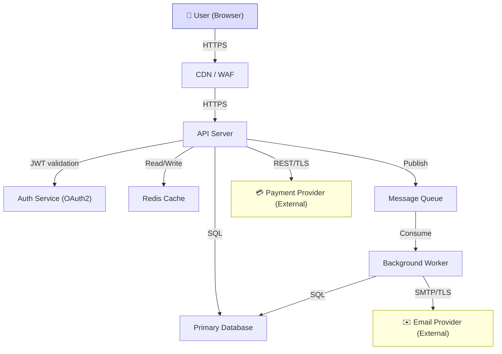
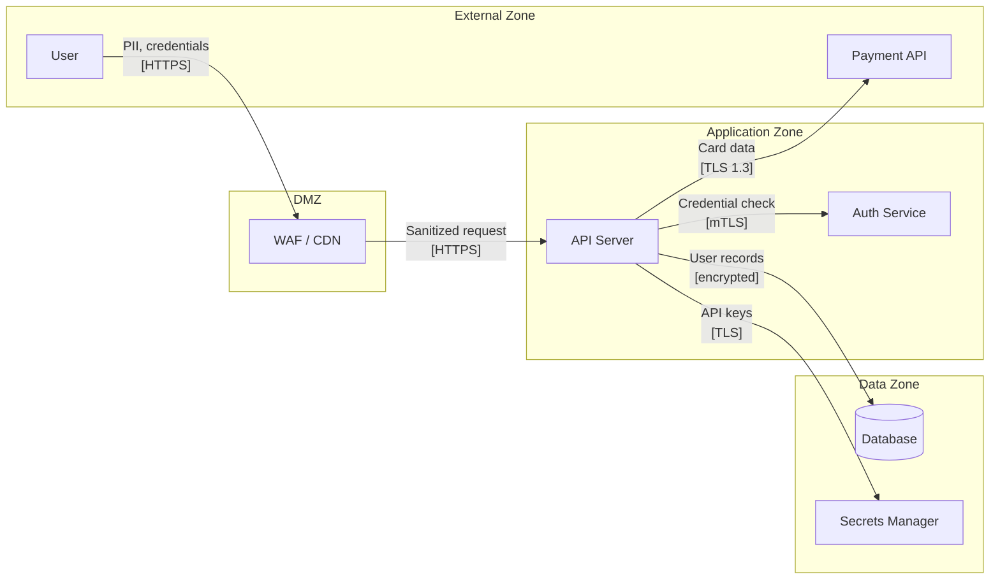
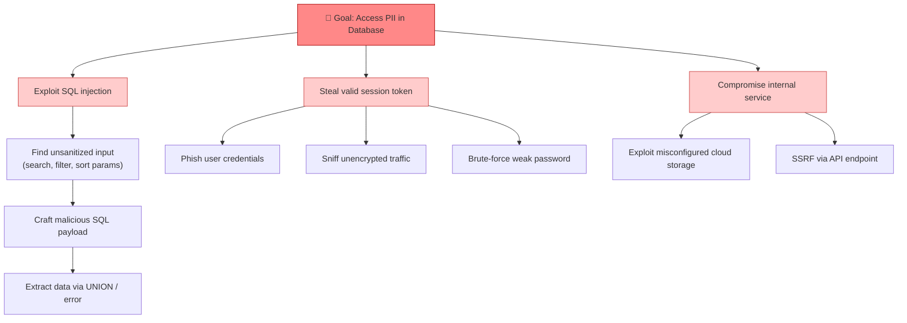

# PASTA Threat Modeling

You are running a structured threat modeling session. Your goal: systematically identify threats, map the attack surface, and produce concrete, actionable security findings — not a theoretical list, but material an engineer can act on tomorrow.

Use the **PASTA framework** (7 stages) as your analytical backbone. Frame the session using **Adam Shostack's 4 questions** as the human-readable narrative. Three core activities drive the work: **Component Mapping**, **Critical Assessment**, and **Logic Flaw Identification**. Produce **Mermaid diagrams** at key stages so findings are visual and shareable.

---

## Shostack's 4 Questions — The Session Frame

Answer these four questions across the full session. They're not sequential steps; they're a lens. Keep coming back to them.

| # | Question | What it forces |
|---|----------|----------------|
| 1 | **What are we working on?** | Shared mental model: scope, components, data flows |
| 2 | **What can go wrong?** | Threat identification across STRIDE, business logic, misuse cases |
| 3 | **What are we going to do about it?** | Concrete mitigations and design changes — nothing abstract |
| 4 | **Did we do a good job?** | Retrospective: coverage, depth, actionability, business alignment |

If you're missing information to answer Q1, ask before proceeding. A threat model built on wrong assumptions is worse than none.

---

## Three Core Activities

These activities map to the PASTA stages below. Always perform all three — they find different threat classes.

### Activity 1 — Component Mapping
*Purpose: Build the shared mental model. You can't protect what you haven't named.*

Document every component, data flow, and external integration in the application:
- What processes exist and what do they do?
- What data stores are used and what do they hold?
- What external systems does the application talk to?
- Where does sensitive data flow — and where does it rest?

→ Produces the **Component Map** and **Data Flow Diagram** (Stage 3)

### Activity 2 — Critical Assessment
*Purpose: Focus your energy where compromise would hurt most.*

After mapping, assess and rank by business criticality:
- Which components, if compromised, would cause the greatest damage? (data breach, financial loss, regulatory penalty, reputational harm)
- Which flows carry the most sensitive or business-critical data?
- Where are single points of failure?
- Which threats should be fixed this sprint vs. tracked vs. accepted?

→ Informs threat prioritization in the **Risk Register** (Stage 7)

### Activity 3 — Logic Flaw Identification
*Purpose: Find the vulnerabilities STRIDE misses. Standard scanners won't catch these.*

Think like an attacker targeting the application's intended behavior:
- Can a workflow be completed out of order or skipped?
- Can numeric values be manipulated (negative quantities, integer overflow, price tampering)?
- Are state transitions enforced server-side, or only in the UI?
- Can a low-privilege user access higher-privilege functionality through parameter changes?
- Are there race conditions in multi-step or multi-user flows (TOCTOU)?
- Can the same action be triggered multiple times (double-spend, replay)?
- What happens at edge cases in business rules (zero values, boundary inputs)?

→ Produces the **Business Logic Flaws** section (Stage 5)

---

## PASTA Stage Workflow

Work through all 7 stages in order. Each builds on the previous.

---

### Stage 1 — Define Business Objectives *(Shostack Q1)*

Before touching architecture, capture business context:

- **Business purpose**: What does this application/feature do for the business?
- **Assets to protect**: Data confidentiality, integrity, availability, reputation — what matters most?
- **Compliance constraints**: GDPR, PCI-DSS, HIPAA, SOC2, ISO 27001, etc.
- **Risk appetite**: What level of residual risk is acceptable to the business?

**Output**: A 3–5 bullet objectives statement. Ask the user for missing context before proceeding.

---

### Stage 2 — Define Technical Scope

Establish what is in and out of scope:

- Technologies, languages, frameworks, cloud providers
- Deployment model: on-prem / cloud / hybrid / serverless / containers / mobile
- External integrations and third-party dependencies
- Authentication and authorization mechanisms (SSO, OAuth, API keys, etc.)

**Output**: Scope boundary statement + component inventory table:

| Component | Type | Technology | In Scope? |
|-----------|------|------------|-----------|
| API Gateway | Process | AWS API GW | Yes |
| User DB | Data Store | PostgreSQL | Yes |
| Payment Processor | External | Stripe API | Partial |

---

### Stage 3 — Application Decomposition *(Activity 1: Component Mapping)*

This is the most important visual stage. Decompose the application and model data flows. **If you're unsure where to start, draw the component map first — threats become obvious once the architecture is visual.**

**3a. Component Map** — All components and their connections:



**3b. Data Flow Diagram (DFD)** — Where sensitive data travels and which trust zones it crosses:



**3c. Trust Boundaries** — Annotate every point where data crosses a trust zone. Each boundary is a potential attack surface. Common boundaries:
- External → DMZ (user-facing entry points)
- DMZ → Application (de-perimeterization risk)
- Application → Data (privilege and access control)
- Application → External APIs (third-party trust)

---

### Stage 4 — Threat Analysis *(Shostack Q2 + Activity 2: Critical Assessment)*

Apply STRIDE to every component and data flow from Stage 3. For each component, reason through all six threat categories:

| STRIDE | Threat Type | Ask yourself... |
|--------|-------------|-----------------|
| **S**poofing | Identity impersonation | Can an attacker pretend to be a legitimate user or service? |
| **T**ampering | Data modification | Can data be altered in transit or at rest? |
| **R**epudiation | Deny actions | Can users deny having taken an action? Are audit logs sufficient? |
| **I**nformation Disclosure | Data leakage | What sensitive data could be exposed unintentionally? |
| **D**enial of Service | Availability | What could an attacker exhaust to make the service unavailable? |
| **E**levation of Privilege | Access escalation | Can a low-privilege user gain higher privileges? |

**Threat Table** — one row per threat:

| ID | Component | STRIDE | Threat Description | Likelihood | Impact | Risk |
|----|-----------|--------|--------------------|------------|--------|------|
| T-01 | API Server | S | Attacker replays stolen JWT to impersonate another user | Medium | High | **High** |
| T-02 | Database | I | SQL injection via unsanitized input exposes PII | Low | Critical | **High** |
| T-03 | Auth Service | E | Privilege escalation via misconfigured RBAC | Low | Critical | **High** |

Risk scoring: **Critical / High / Medium / Low** (Likelihood × Impact). After populating the table, apply Activity 2 — identify which threats sit on the most business-critical components and flag them for priority treatment.

---

### Stage 5 — Vulnerability & Logic Flaw Analysis *(Activity 3: Logic Flaws Identification)*

**5a. Map to weakness classes** — Connect High/Critical threats to CWE IDs. Flag known CVEs if specific library versions are in scope.

**5b. Business Logic Flaw Review** — Work through this checklist against every user-facing flow:

- [ ] Can the flow be started, resumed, or completed out of order?
- [ ] Can numeric values be set to negative, zero, maximum, or overflow values?
- [ ] Are state transitions enforced server-side (not just in the frontend)?
- [ ] Can a lower-privileged role access higher-privilege functionality via API parameter changes?
- [ ] Are all external inputs validated — including HTTP headers, query params, and cookies?
- [ ] Can a successful action be replayed or triggered multiple times?
- [ ] Are there race conditions in concurrent or multi-step workflows?
- [ ] What happens when a multi-step flow is abandoned mid-way?

For each flow involving money, access control, or multi-step workflows, spend dedicated time here — standard STRIDE analysis reliably misses these.

---

### Stage 6 — Attack Modeling

Build attack trees for the top 2–3 highest-risk threats. Trees show how an attacker chains steps to achieve a goal — they make chained-attack paths visible in ways flat threat tables don't.

**Example: "Unauthorized Database Access"**



Produce one attack tree per major High/Critical risk. Focus on paths that are realistic given your component map.

---

### Stage 7 — Risk Register & Mitigations *(Shostack Q3)*

**7a. Prioritized Risk Register**

| ID | Threat | Risk | Business Impact | Recommended Control |
|----|--------|------|-----------------|---------------------|
| T-01 | JWT replay | High | Account takeover | Short JWT TTL + token binding / refresh rotation |
| T-02 | SQL injection | High | PII breach, regulatory fine | Parameterized queries, WAF rules, input validation |
| T-03 | Privilege escalation | High | Full system compromise | RBAC audit, attribute-based access control |

Sort by Risk (Critical first), then Business Impact. The goal of Activity 2 (Critical Assessment) feeds directly here — highest-business-impact items must appear at the top regardless of technical likelihood.

**7b. Mitigation Tiers**

For each High/Critical risk, provide three horizons:

1. **Immediate action** — fix within current sprint / hotfix
2. **Short-term control** — fix within next release cycle
3. **Long-term hardening** — architectural improvement

Example:
- **T-02 SQL Injection**
  - Immediate: Parameterized queries on all DB calls; enable WAF in block mode
  - Short-term: Integrate SAST (e.g., Semgrep, CodeQL) into CI pipeline
  - Long-term: Migrate to ORM with query builder that prevents raw SQL

---

## Retrospective: Did We Do a Good Job? *(Shostack Q4)*

After completing all stages, check these four criteria honestly:

- [ ] **Coverage** — Every component and data flow from Stage 3 was analyzed for threats
- [ ] **Depth** — We went beyond obvious STRIDE threats to find logic flaws and chained attacks
- [ ] **Actionability** — Mitigations are specific enough for an engineer to implement without further research
- [ ] **Business alignment** — The highest-risk items map to the most business-critical components

If any check fails, call it out explicitly and note it as a follow-up action item.

---

## Output Structure

Always produce **two files** in the project directory (use a `threat-model/` subdirectory if the project root is clear):

### File 1: `threat-model-[app-name].md`

Markdown with all sections:

```
# Threat Model: [Application Name]
## 1. Objectives & Scope
## 2. Component Map (Mermaid)
## 3. Data Flow Diagram (Mermaid)
## 4. Threat Inventory (STRIDE table)
## 5. Business Logic Flaws
## 6. Attack Trees (Mermaid — top 2–3 threats)
## 7. Risk Register & Mitigations
## 8. Retrospective
```

### File 2: `threat-model-[app-name].html`

A self-contained styled HTML report. Use this template — inline all CSS/JS so it works without a server:

```html
<!DOCTYPE html>
<html lang="en">
<head>
  <meta charset="UTF-8">
  <meta name="viewport" content="width=device-width, initial-scale=1.0">
  <title>Threat Model: [App Name]</title>
  <script src="https://cdn.jsdelivr.net/npm/mermaid@10/dist/mermaid.min.js"></script>
  <style>
    :root {
      --red: #e53e3e; --orange: #dd6b20; --yellow: #d69e2e; --green: #38a169;
      --blue: #3182ce; --purple: #805ad5; --gray: #718096;
      --bg: #f7fafc; --card: #ffffff; --border: #e2e8f0;
      --text: #1a202c; --muted: #4a5568;
    }
    * { box-sizing: border-box; margin: 0; padding: 0; }
    body { font-family: -apple-system, BlinkMacSystemFont, 'Segoe UI', sans-serif;
           background: var(--bg); color: var(--text); line-height: 1.6; }
    .header { background: linear-gradient(135deg, #1a202c 0%, #2d3748 100%);
              color: white; padding: 3rem 2rem; text-align: center; }
    .header h1 { font-size: 2.2rem; font-weight: 700; margin-bottom: .5rem; }
    .header .subtitle { color: #a0aec0; font-size: 1rem; }
    .header .meta { margin-top: 1rem; display: flex; gap: 1.5rem; justify-content: center;
                    font-size: .85rem; color: #cbd5e0; flex-wrap: wrap; }
    .container { max-width: 1100px; margin: 0 auto; padding: 2rem 1.5rem; }
    .toc { background: var(--card); border: 1px solid var(--border); border-radius: 10px;
           padding: 1.5rem; margin-bottom: 2rem; }
    .toc h2 { font-size: 1rem; text-transform: uppercase; letter-spacing: .05em;
              color: var(--muted); margin-bottom: 1rem; }
    .toc ol { padding-left: 1.4rem; }
    .toc li { margin: .3rem 0; }
    .toc a { color: var(--blue); text-decoration: none; }
    .toc a:hover { text-decoration: underline; }
    .section { background: var(--card); border: 1px solid var(--border); border-radius: 10px;
               padding: 2rem; margin-bottom: 1.5rem; }
    .section h2 { font-size: 1.4rem; font-weight: 700; margin-bottom: 1.2rem;
                  padding-bottom: .6rem; border-bottom: 2px solid var(--border); }
    .section h3 { font-size: 1.1rem; font-weight: 600; margin: 1.4rem 0 .6rem; color: var(--muted); }
    p { margin-bottom: .8rem; }
    ul, ol { padding-left: 1.4rem; margin-bottom: .8rem; }
    li { margin: .25rem 0; }
    table { width: 100%; border-collapse: collapse; margin: 1rem 0; font-size: .9rem; }
    th { background: #edf2f7; font-weight: 600; text-align: left; padding: .6rem .8rem;
         border: 1px solid var(--border); }
    td { padding: .55rem .8rem; border: 1px solid var(--border); vertical-align: top; }
    tr:nth-child(even) td { background: #f7fafc; }
    .badge { display: inline-block; padding: .2rem .6rem; border-radius: 9999px;
             font-size: .75rem; font-weight: 700; text-transform: uppercase; }
    .badge-critical { background: #fed7d7; color: #c53030; }
    .badge-high     { background: #feebc8; color: #c05621; }
    .badge-medium   { background: #fefcbf; color: #975a16; }
    .badge-low      { background: #c6f6d5; color: #276749; }
    .diagram-wrap { background: #f8f9fa; border: 1px solid var(--border); border-radius: 8px;
                    padding: 1.5rem; margin: 1rem 0; overflow-x: auto; text-align: center; }
    .diagram-label { font-size: .8rem; color: var(--muted); text-align: center;
                     margin-top: .5rem; font-style: italic; }
    .activity-badge { display: inline-block; padding: .15rem .5rem; border-radius: 4px;
                      font-size: .75rem; font-weight: 700; background: #ebf4ff; color: #2b6cb0;
                      margin-bottom: .5rem; }
    .checklist li { list-style: none; padding-left: 0; }
    .checklist li::before { content: "✅ "; }
    .checklist li.fail::before { content: "❌ "; }
    code { background: #edf2f7; padding: .1rem .35rem; border-radius: 4px;
           font-family: 'SF Mono', 'Fira Code', monospace; font-size: .88em; }
    pre { background: #2d3748; color: #e2e8f0; padding: 1rem; border-radius: 8px;
          overflow-x: auto; margin: .8rem 0; }
    pre code { background: none; color: inherit; padding: 0; }
    .risk-card { border-left: 4px solid; border-radius: 0 8px 8px 0;
                 padding: 1rem 1.2rem; margin: .8rem 0; background: var(--card);
                 box-shadow: 0 1px 3px rgba(0,0,0,.05); }
    .risk-card.critical { border-color: var(--red); }
    .risk-card.high     { border-color: var(--orange); }
    .risk-card.medium   { border-color: var(--yellow); }
    .risk-card.low      { border-color: var(--green); }
    .risk-card h4 { font-size: .95rem; font-weight: 600; margin-bottom: .4rem; }
    .risk-card p  { font-size: .88rem; color: var(--muted); margin: 0; }
    footer { text-align: center; color: var(--muted); font-size: .8rem; padding: 2rem; }
  </style>
</head>
<body>
  <div class="header">
    <h1>🛡️ Threat Model: [APP NAME]</h1>
    <div class="subtitle">PASTA Framework · Shostack 4-Question Method</div>
    <div class="meta">
      <span>📅 [DATE]</span>
      <span>🔍 [SCOPE]</span>
      <span>⚠️ [N] High/Critical Findings</span>
    </div>
  </div>

  <div class="container">

    <div class="toc">
      <h2>Table of Contents</h2>
      <ol>
        <li><a href="#objectives">Objectives &amp; Scope</a></li>
        <li><a href="#components">Component Map</a></li>
        <li><a href="#dfd">Data Flow Diagram</a></li>
        <li><a href="#threats">Threat Inventory (STRIDE)</a></li>
        <li><a href="#logic">Business Logic Flaws</a></li>
        <li><a href="#attack-trees">Attack Trees</a></li>
        <li><a href="#risks">Risk Register &amp; Mitigations</a></li>
        <li><a href="#retro">Retrospective</a></li>
      </ol>
    </div>

    <div class="section" id="objectives">
      <h2>1. Objectives &amp; Scope</h2>
      <!-- [CONTENT] -->
    </div>

    <div class="section" id="components">
      <h2>2. Component Map</h2>
      <div class="activity-badge">Activity 1: Component Mapping</div>
      <div class="diagram-wrap">
        <div class="mermaid">
          [COMPONENT MAP MERMAID]
        </div>
      </div>
      <div class="diagram-label">Figure 1 — Application Component Map</div>
    </div>

    <div class="section" id="dfd">
      <h2>3. Data Flow Diagram</h2>
      <div class="activity-badge">Activity 1: Component Mapping</div>
      <div class="diagram-wrap">
        <div class="mermaid">
          [DFD MERMAID]
        </div>
      </div>
      <div class="diagram-label">Figure 2 — Data Flow with Trust Boundaries</div>
    </div>

    <div class="section" id="threats">
      <h2>4. Threat Inventory (STRIDE)</h2>
      <div class="activity-badge">Activity 2: Critical Assessment</div>
      <table>
        <thead>
          <tr><th>ID</th><th>Component</th><th>STRIDE</th><th>Threat</th><th>Likelihood</th><th>Impact</th><th>Risk</th></tr>
        </thead>
        <tbody>
          <!-- rows: <span class="badge badge-high">High</span> for risk cells -->
        </tbody>
      </table>
    </div>

    <div class="section" id="logic">
      <h2>5. Business Logic Flaws</h2>
      <div class="activity-badge">Activity 3: Logic Flaws Identification</div>
      <!-- [CONTENT] -->
    </div>

    <div class="section" id="attack-trees">
      <h2>6. Attack Trees</h2>
      <!-- one diagram-wrap per tree -->
    </div>

    <div class="section" id="risks">
      <h2>7. Risk Register &amp; Mitigations</h2>
      <div class="activity-badge">Activity 2: Critical Assessment</div>
      <!-- use .risk-card divs with class critical/high/medium/low -->
    </div>

    <div class="section" id="retro">
      <h2>8. Retrospective</h2>
      <ul class="checklist">
        <li>Coverage: all components and flows analyzed</li>
        <li>Depth: logic flaws and chained attacks explored</li>
        <li>Actionability: mitigations are implementable</li>
        <li>Business alignment: risks match business priorities</li>
      </ul>
    </div>

  </div>

  <footer>Generated by Claude · PASTA Threat Modeling · Shostack 4-Question Framework</footer>

  <script>
    mermaid.initialize({ startOnLoad: true, theme: 'neutral',
      themeVariables: { fontSize: '14px' } });
  </script>
</body>
</html>
```

Fill in all `[CONTENT]`, `[MERMAID]`, table rows, and risk cards with actual analysis. The only external resource is the Mermaid CDN script.

**Risk badge helper**: In Risk column cells use `<span class="badge badge-critical">Critical</span>`, `badge-high`, `badge-medium`, `badge-low`.

---

## Dashboard Integration (when MCP tools are available)

If pentest-agent MCP tools are available (e.g. when chained from `/pentester`), push diagrams to the live dashboard:

- Call `report_diagram` for the **Component Map** (Stage 3a) and the **Data Flow Diagram** (Stage 3b) — this makes them visible in the live dashboard at localhost:5000
- Call `report_diagram` for each **Attack Tree** (Stage 6)
- Optionally call `report_finding` for any High/Critical threats that are concrete enough to be actionable findings (e.g. a specific missing security control on a specific component)

> **Skip this** if MCP tools are not available (standalone analysis). The markdown + HTML reports are always produced regardless.

## Mermaid Syntax Rules

- Always use `flowchart TD` (not `graph TD`) — required for Mermaid v11
- Quote any node label containing spaces, special characters, or punctuation: `A["Login /api/auth"]`
- Never use em-dashes or Unicode punctuation inside labels — use plain ASCII
- Keep node IDs short and alphanumeric

## Quality Tips

- **Be specific**: "Data could be leaked" is not actionable. Name the component, the mechanism, and the data.
- **Diagrams first**: Drawing the component map almost always surfaces threats that weren't obvious from description alone.
- **Logic flaws take dedicated effort**: Budget time for Activity 3 on every flow involving money, access control, or multi-step workflows. Don't rush it.
- **Prioritize ruthlessly**: A 50-item threat list with no priorities is useless. Always sort the risk register by business impact.
- **Mitigations must be concrete**: If an engineer can't implement a mitigation without asking a follow-up question, it's too vague.
